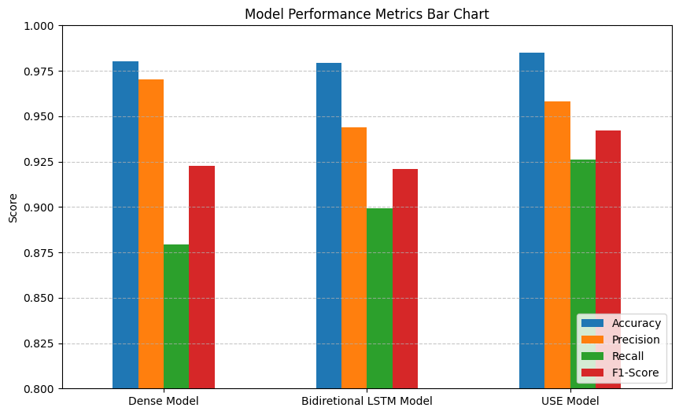

# SMS Spam Detection using TensorFlow

A machine learning project that implements and compares three different deep learning architectures for SMS spam classification. The project uses TensorFlow/Keras to build models ranging from simple dense embeddings to advanced transfer learning approaches.

## 🎯 Project Overview

This project aims to filter incoming SMS messages and protect users from spam by automatically classifying messages as spam or legitimate (ham). Three different models are implemented and compared:

1. **Dense Embedding Model** - A simple feedforward neural network with word embeddings
2. **Bidirectional LSTM Model** - A recurrent neural network that processes text bidirectionally
3. **Universal Sentence Encoder (USE) Model** - A transfer learning approach using Google's pre-trained USE

## 📊 Dataset

The project uses the SMS Spam Collection dataset, which contains:
- **Total Messages**: 5,572 SMS messages
- **Classes**: Binary classification (Spam/Ham)
- **Source**: [SMS Spam Collection Dataset](https://raw.githubusercontent.com/fatahrahimi330/100-Machine-Learning-Projects/refs/heads/master/2-SMS-Spam-Detection/spam.csv)

## 🔧 Technologies & Libraries

- **Python 3.x**
- **TensorFlow/Keras** - Deep learning framework
- **TensorFlow Hub** - For Universal Sentence Encoder
- **scikit-learn** - For data splitting and metrics
- **pandas** - Data manipulation and analysis
- **numpy** - Numerical computing
- **matplotlib & seaborn** - Data visualization

## 📁 Project Structure

```
2-SMS-Spam-Detection/
│
├── sms_spam_detection.ipynb    # Main Jupyter notebook
├── spam.csv                     # Dataset file
└── README.md                    # Project documentation
```

## 🚀 Getting Started

### Prerequisites

Install the required packages:

```bash
pip install numpy pandas matplotlib seaborn tensorflow tensorflow-hub scikit-learn
```

### Running the Project

1. Clone the repository or download the project files
2. Open the Jupyter notebook:
   ```bash
   jupyter notebook sms_spam_detection.ipynb
   ```
3. Run all cells sequentially to:
   - Load and preprocess the data
   - Train all three models
   - Evaluate and compare results
   - Visualize performance metrics

## 🔍 Methodology

### Data Preprocessing

1. **Data Cleaning**:
   - Remove irrelevant columns with NaN values
   - Rename columns for clarity (`v1` → `Target`, `v2` → `SMS`)
   
2. **Label Encoding**:
   - Encode target labels: `0` for Ham (legitimate), `1` for Spam

3. **Train-Test Split**:
   - 80% training data
   - 20% test data
   - Random state: 42 for reproducibility

### Model Architectures

#### Model 1: Dense Embedding Model
- Input: String text
- TextVectorization layer
- Embedding layer (128 dimensions)
- GlobalAveragePooling1D
- Dense layer (32 units, ReLU)
- Output: Sigmoid activation

#### Model 2: Bidirectional LSTM Model
- Input: String text
- TextVectorization layer
- Embedding layer (128 dimensions)
- 2 Bidirectional LSTM layers (64 units each)
- Dropout (0.1)
- Dense layer (32 units, ReLU)
- Output: Sigmoid activation

#### Model 3: Transfer Learning (USE Model)
- Input: String text (no preprocessing needed)
- Universal Sentence Encoder layer (512-dim embeddings)
- Dense layer (64 units, ReLU)
- Dropout (0.2)
- Output: Sigmoid activation

### Training Configuration

- **Loss Function**: Binary Crossentropy
- **Optimizer**: Adam
- **Metrics**: Accuracy
- **Early Stopping**: Patience of 3 epochs on validation accuracy
- **Max Epochs**: 5

## 📈 Evaluation Metrics

All models are evaluated using:
- **Accuracy**: Overall correctness of predictions
- **Precision**: True positives / (True positives + False positives)
- **Recall**: True positives / (True positives + False negatives)
- **F1-Score**: Harmonic mean of precision and recall

## 📊 Results

The project includes comprehensive visualizations:

1. **Bar Chart**: Comparing all metrics across all three models

2. **Line Graph**: Showing performance trends for each metric

All models achieve high performance (typically 95%+ accuracy), with the Universal Sentence Encoder model often showing the best balance across all metrics.

## 💡 Key Features

- **Multiple Architectures**: Compare different deep learning approaches
- **Text Vectorization**: Automatic text preprocessing and tokenization
- **Transfer Learning**: Leverage pre-trained language models
- **Comprehensive Evaluation**: Multiple metrics for thorough assessment
- **Visual Analytics**: Clear visualization of model performance
- **Early Stopping**: Prevent overfitting with automatic training termination

## 🔮 Future Improvements

- [ ] Add more advanced models (BERT, GPT-based)
- [ ] Implement cross-validation for more robust evaluation
- [ ] Add confusion matrix visualization
- [ ] Deploy as a web service or API
- [ ] Add real-time SMS classification capability
- [ ] Experiment with ensemble methods
- [ ] Add more preprocessing techniques (stemming, lemmatization)

## 📝 Usage Example

After training, you can use any model to predict spam:

```python
# Example prediction
test_message = ["Congratulations! You've won a free prize. Click here to claim."]
prediction = model_3.predict(test_message)

if prediction > 0.5:
    print("This is SPAM 🚫")
else:
    print("This is HAM ✅")
```

## 📖 Learning Outcomes

This project demonstrates:
- Text preprocessing and vectorization techniques
- Building and training neural networks with Keras
- Implementing different architectures (Dense, LSTM, Transfer Learning)
- Using pre-trained models from TensorFlow Hub
- Model evaluation and comparison
- Data visualization for model performance

## 👤 Author

Fatah Rahimi

## 📄 License

This project is part of the 100+ Machine Learning Projects series.

## 🙏 Acknowledgments

- SMS Spam Collection dataset creators
- Google for the Universal Sentence Encoder
- TensorFlow and Keras development teams

---

**Note**: This is an educational project demonstrating various deep learning techniques for text classification. For production use, additional considerations for model deployment, monitoring, and maintenance would be required.
