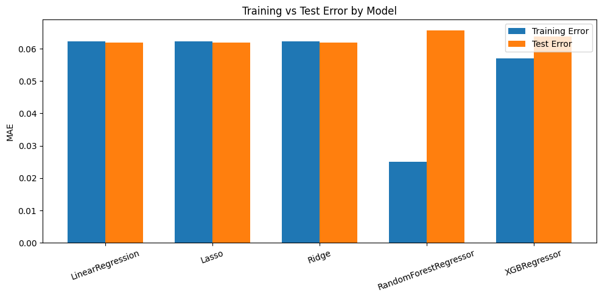

# Home Price Prediction

This project builds a machine learning pipeline to predict Zillow home prices using multiple regression models in scikit-learn and XGBoost.

## Project Files

- `home_price_prediction.ipynb` — main notebook for data cleaning, analysis, training, and prediction
- `Zillow.csv` — dataset used for training and evaluation

## Project Workflow

The notebook covers the full ML workflow:

1. Import libraries
2. Load the Zillow dataset
3. Clean missing and low-information columns
4. Perform exploratory data analysis (EDA)
5. Preprocess features
6. Train and compare multiple regression models
7. Make predictions on test data

## Models Used

The project compares these algorithms:

- Linear Regression
- Lasso Regression
- Ridge Regression
- Random Forest Regressor
- XGBoost Regressor

## Libraries

Install the required Python packages before running the notebook:

```bash
pip install numpy pandas matplotlib seaborn scikit-learn xgboost jupyter
```

## How to Run

1. Open `home_price_prediction.ipynb`
2. Make sure `Zillow.csv` is available in the project folder
3. Run the notebook cells in order
4. Review the training and test MAE results to compare model performance

## Preprocessing Summary

The notebook includes the following preprocessing steps:

- Removes columns with a single unique value
- Removes columns with a high percentage of missing data
- Fills missing categorical values using the mode
- Encodes categorical features with `LabelEncoder`
- Removes highly correlated features
- Splits data into training and testing sets
- Scales features using `StandardScaler`

## Evaluation Metric

Model performance is evaluated using **Mean Absolute Error (MAE)** for both training and testing data.


## Output

The notebook:

- trains all models
- compares training vs. test errors in a bar chart
- generates sample predictions on the test set

## Notes

- The notebook includes a `wget` step to download the dataset, but the dataset is already present in this folder as `Zillow.csv`.
- XGBoost must be installed separately if it is not already available in your environment.

## Author

Part of the **100+ Machine Learning Projects** collection.
