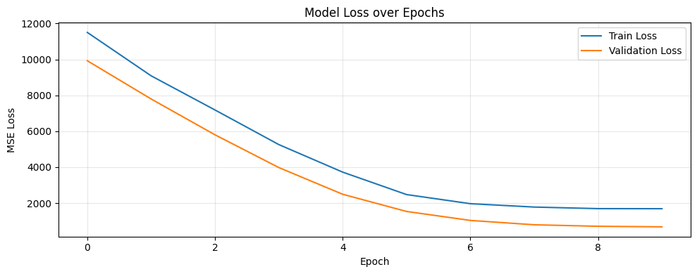
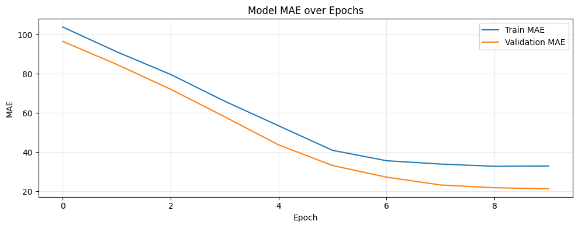
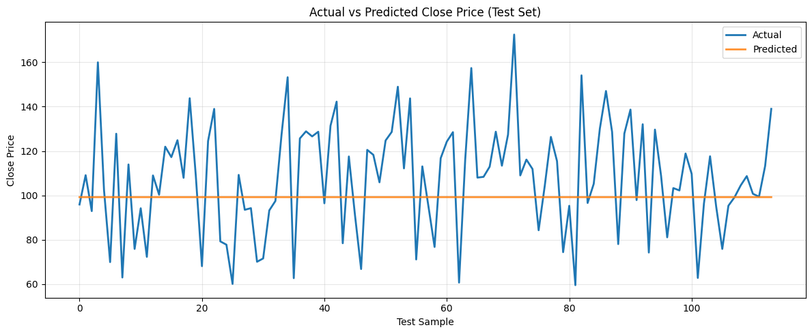

# 📈 Stock Price Prediction using LSTM (TensorFlow)


This project builds a Long Short-Term Memory (LSTM) neural network to predict Apple (AAPL) stock closing prices from historical data.

---

## ✨ Highlights

- End-to-end notebook pipeline (EDA → preprocessing → sequence generation → LSTM training → evaluation)
- Time-series sequence modeling with a **60-day lookback window**
- Clear visualization of training behavior (Loss and MAE)
- Regression-focused evaluation with `MSE`, `MAE`, and `R²`

## 📁 Project Structure

- `all_stocks_5yr.csv` — historical stock data for multiple companies.
- `stock_price_prediction.ipynb` — end-to-end notebook (EDA → preprocessing → training → evaluation).

## 🎯 Objective

Predict the next closing price using a sliding window of previous closing prices.

- Problem type: **Regression**
- Model: **Deep Learning (LSTM)**
- Framework: **TensorFlow / Keras**

## 🧾 Dataset

Source file: `all_stocks_5yr.csv`

Key columns used:

- `date`
- `open`
- `high`
- `low`
- `close`
- `volume`
- `Name` (ticker symbol)

The notebook filters data for `AAPL` and uses `close` as the target series.

---

## ⚙️ Workflow

### 1) Import libraries

Core packages used:

- `numpy`
- `pandas`
- `matplotlib`
- `seaborn`
- `scikit-learn`
- `tensorflow`

### 2) Load and inspect data

- Read CSV with pandas.
- Inspect with `head()`, `shape`, `describe()`, `info()`.
- Convert `date` to datetime.

### 3) Exploratory Data Analysis (EDA)

- Plot open/close trends for selected companies.
- Plot volume trends.
- Plot Apple close price over time.

### 4) Build features and target

- Extract Apple close prices.
- Build time-window sequences with lookback = 60:
  - `X`: previous 60 close values
  - `y`: next close value

### 5) Train/test preparation

Current notebook flow:

1. Uses the first 95% of sequence-ready data for sequence construction.
2. Splits generated sequences into train/test via `train_test_split(test_size=0.1)`.
3. Scales `X_train` and `X_test` with `MinMaxScaler`.
4. Reshapes input to LSTM shape:
   - `(samples, timesteps, features)`
   - here: `(n, 60, 1)`

### 6) Model architecture

Sequential model:

1. `LSTM(64, return_sequences=True)`
2. `LSTM(64)`
3. `Dense(32, activation="relu")`
4. `Dropout(0.5)`
5. `Dense(1)`

### 7) Compile and train

- Optimizer: `adam`
- Loss: `mse`
- Metric: `mae`
- Validation: `(X_test, y_test)`
- Epochs: 10

### 8) Evaluate and visualize

- Loss/MAE history plots.
- Predictions with `model.predict(X_test)`.
- Regression metrics (e.g., `mean_squared_error`, `r2_score`).

## 🚀 Quick Start

1. Open `stock_price_prediction.ipynb`.
2. Run cells in order from top to bottom.
3. Ensure required packages are installed in your Python environment.

### Install dependencies

```bash
pip install numpy pandas matplotlib seaborn scikit-learn tensorflow
```

## 📦 Requirements

Install these Python packages:

- numpy
- pandas
- matplotlib
- seaborn
- scikit-learn
- tensorflow

## 📊 Results (Latest Run)

The model trains successfully and both training/validation curves decrease consistently.

### Metrics snapshot

| Metric | Value |
|---|---:|
| Final Validation Loss (MSE) | 677.5710 |
| Final Validation MAE | 21.2710 |
| Example Actual (first test point) | 95.91 |
| Example Predicted (first test point) | 99.22 |

> Note: Values can vary by environment, randomization, and data split strategy.

### Training curves

Add your exported notebook plots here (recommended path: `docs/images/`):




### Prediction sample visualization

Optional chart to add after plotting actual vs predicted values:



## 🧠 Notes and Best Practices

- `r2_score` is a **regression** metric (correct for this project).
- For time-series tasks, a chronological split is usually better than random split.
- Scaling the full close series before sequence generation can improve stability and interpretability.
- You can inverse-transform predictions to compare in original price units.

## 🔧 Suggested Improvements

- Use strict time-based train/validation/test split.
- Add early stopping and model checkpointing.
- Tune hyperparameters (`lookback`, LSTM units, dropout, epochs, batch size).
- Add RMSE and MAPE.
- Save and load trained model (`model.save(...)`).

---

## 📌 Future Scope

- Multi-feature modeling (`open`, `high`, `low`, `volume`, technical indicators)
- Multi-step forecasting (predict next 5/10 days)
- Compare LSTM against GRU, 1D-CNN, and Transformer-based models
- Deploy as a small web app for interactive inference

## 🙌 Acknowledgments

Dataset and project idea are part of the "100+ Machine Learning Projects" collection.
