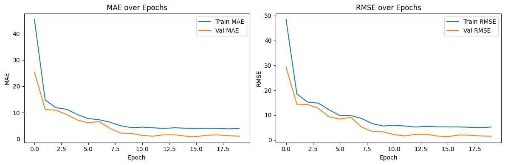
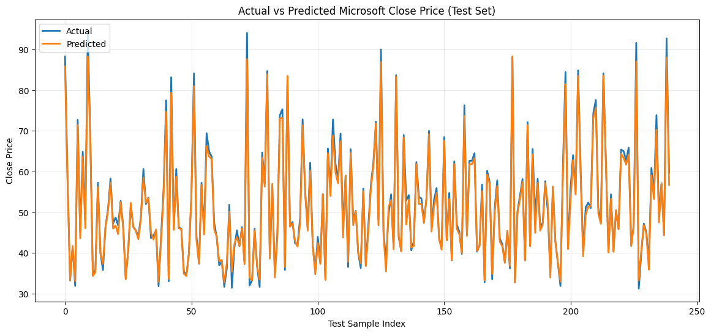

# Microsoft Stock Price Prediction (LSTM)

A deep learning regression project that predicts Microsoft stock **close price** using an **LSTM** model built with TensorFlow/Keras.

This project is implemented in a single notebook and includes:
- data loading and EDA
- sequence preparation for time-series modeling
- LSTM training and validation
- model evaluation with multiple metrics
- prediction and visualization

---

## Table of Contents
- [Project Overview](#project-overview)
- [Dataset](#dataset)
- [Tech Stack](#tech-stack)
- [Project Structure](#project-structure)
- [Workflow](#workflow)
- [Model Architecture](#model-architecture)
- [Results](#results)
- [How to Run](#how-to-run)
- [Output Visualizations](#output-visualizations)
- [Future Improvements](#future-improvements)
- [Author](#author)

---

## Project Overview

The goal is to predict Microsoft stock close prices using historical price sequences.

The notebook creates sliding windows of length 60 from the close-price series, trains an LSTM model on those sequences, and evaluates prediction performance on a held-out test split.

---

## Dataset

- **File:** `MicrosoftStock.csv`
- **Target column:** `close`
- **Other available columns:** includes date/time and market-related numerical features

The notebook converts the date column to datetime and uses visual analysis (line plots + correlation heatmap) before modeling.

---

## Tech Stack

- Python 3
- NumPy
- Pandas
- Matplotlib
- Seaborn
- Scikit-learn
- TensorFlow / Keras

---

## Project Structure

```text
24-Microsoft Stock Price Prediction/
├── MicrosoftStock.csv
├── microsoft_stock_price_prediction.ipynb
└── README.md
```

---

## Workflow

1. **Load data** from CSV.
2. **Preprocess data** and perform EDA.
3. Build supervised sequences using a **60-step lookback window**:
   - `X[i] = close[i-60:i]`
   - `y[i] = close[i]`
4. Convert `X` and `y` to NumPy arrays.
5. Split train/test using `train_test_split` (80/20).
6. Apply `StandardScaler` on 2D features, then reshape to 3D for LSTM:
   - `(samples, timesteps, features)` = `(n, 60, 1)`
7. Train LSTM model for 20 epochs.
8. Evaluate model on test set and generate predictions.
9. Visualize learning curves and actual-vs-predicted values.

---

## Model Architecture

The model is a Sequential network:

1. `LSTM(64, return_sequences=True)`
2. `LSTM(64)`
3. `Dense(128)`
4. `Dropout(0.5)`
5. `Dense(1)`

Compile configuration:
- Optimizer: `adam`
- Loss: `mae`
- Metric: `RootMeanSquaredError`

---

## Results

From the latest run in the notebook:

- **Test MAE:** `1.0579`
- **Test RMSE:** `1.4969`
- **Test R²:** `0.9890`


These results indicate strong predictive performance on the test split.

---

## How to Run

### 1) Clone repository

```bash
git clone <your-repo-url>
cd "24-Microsoft Stock Price Prediction"
```

### 2) Install dependencies

```bash
pip install numpy pandas matplotlib seaborn scikit-learn tensorflow jupyter
```

### 3) Start notebook

```bash
jupyter notebook
```

Open `microsoft_stock_price_prediction.ipynb` and run all cells in order.

---

## Output Visualizations

The notebook currently produces:

- Open vs Close price trend
- Volume trend over time
- Correlation heatmap for numerical features
- Training/validation curves (MAE and RMSE)
- Actual vs Predicted close price plot (test set)

---

## Future Improvements

- Replace random split with chronological split for stricter time-series validation
- Add MinMax scaling comparison with StandardScaler
- Add model checkpointing and early stopping
- Tune sequence length and LSTM hyperparameters
- Forecast future unseen time horizons

---

## Author

**Fatah Rahimi**

If this project is useful, consider starring the repository.
