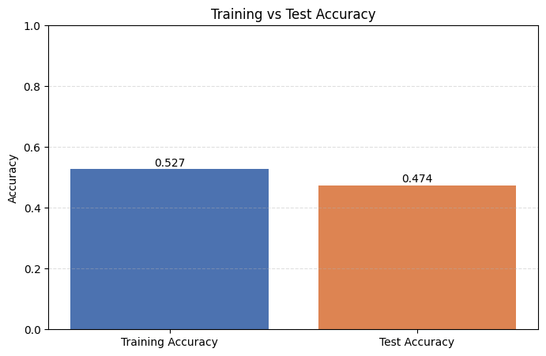

# Predicting Stock Price Direction using SVM

This project builds a binary classification model to predict the **next-day stock price direction** (up/down) for RELIANCE stock using a **Support Vector Machine (SVM)** in scikit-learn.

## Project Overview

The notebook performs an end-to-end ML workflow:

1. Load historical stock data (`RELIANCE.csv`)
2. Perform basic exploratory analysis
3. Engineer simple price-action features
4. Train an SVM classifier
5. Evaluate training and test accuracy
6. Visualize model performance with a bar plot
7. Make sample predictions on test data

## Dataset

- **File:** `RELIANCE.csv`
- Typical columns used in the notebook:
  - `Date`
  - `Open`
  - `High`
  - `Low`
  - `Close`

## Features and Target

### Engineered Features

- `close-open = Close - Open`
- `high-low = High - Low`

### Target Variable

- `y = 1` if next day's close is higher than today's close
- `y = 0` otherwise

Mathematically:

$$
y_t = \begin{cases}
1, & \text{if } Close_{t+1} > Close_t \\
0, & \text{otherwise}
\end{cases}
$$

## Model

- **Algorithm:** `sklearn.svm.SVC`
- **Train/Test split:** 80/20 (`random_state=42`)
- **Metrics:** Accuracy on train and test sets

## Visualization



This helps quickly check whether the model is overfitting or generalizing reasonably.

## Project Structure

```text
25-Predicting Stock Price Direction/
├── predicting_stock_price_direction.ipynb
├── RELIANCE.csv
└── README.md
```

## Requirements

Install Python dependencies:

- numpy
- pandas
- matplotlib
- seaborn
- scikit-learn
- jupyter

## Quick Start

1. Open the project folder.
2. Launch Jupyter Notebook (or VS Code Notebook UI).
3. Open `predicting_stock_price_direction.ipynb`.
4. Run cells from top to bottom.

If the dataset is already present locally, you can skip the download cell.

## Notes

- This notebook is educational and intentionally simple.
- Only two handcrafted features are used, so predictive power may be limited.
- The current split is random; for time-series robustness, consider chronological splits.

## Possible Improvements

- Add technical indicators (RSI, MACD, moving averages, Bollinger Bands)
- Use `StandardScaler` + pipeline for SVM
- Time-series cross-validation (`TimeSeriesSplit`)
- Hyperparameter tuning (`C`, `gamma`, kernel)
- Evaluate with precision, recall, F1-score, ROC-AUC
- Backtest strategy returns (not only classification accuracy)

## Disclaimer

This project is for learning purposes only and is **not financial advice**. Do not use it directly for live trading decisions.