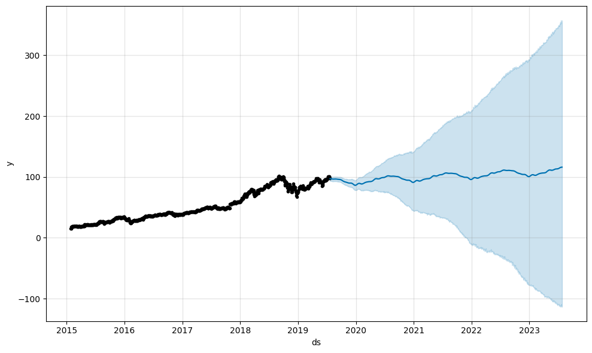
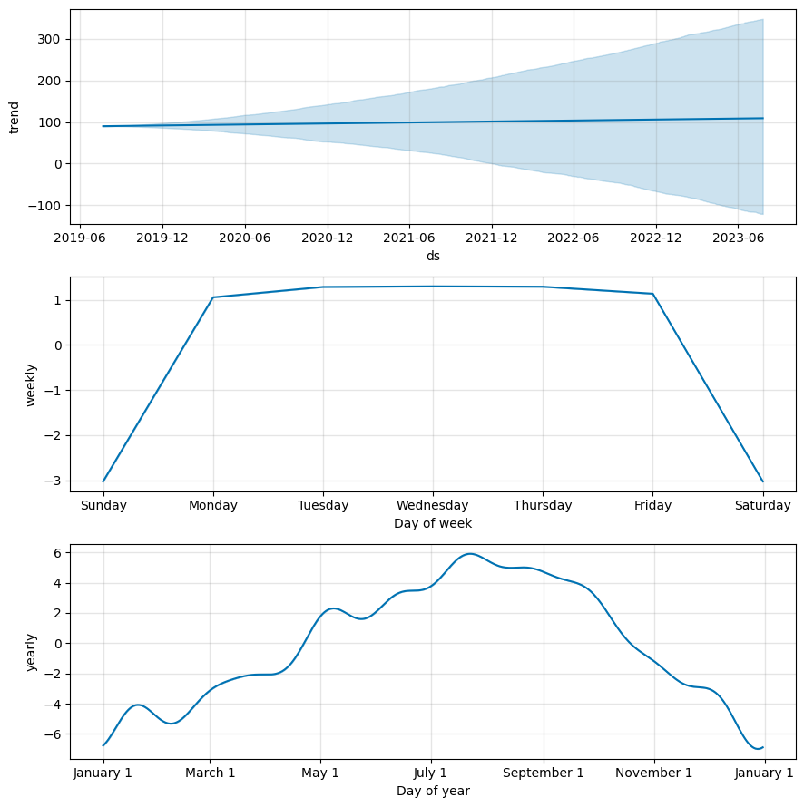

# 📈 Share Price Forecasting using Facebook Prophet

This project demonstrates time series forecasting of stock share prices using **Facebook Prophet**, a powerful open-source forecasting library developed by Meta.

---

## 📁 Project Structure

```
26-Share Price Forecasting/
├── share_price_forecasting.ipynb   # Main Jupyter Notebook
├── Share-Price-Forecasting.csv     # Dataset
└── README.md                       # Project documentation
```

---

## 📌 Overview

The goal of this project is to forecast future stock share prices based on historical adjusted closing prices. The workflow covers data preprocessing, model training, prediction, and evaluation using standard regression metrics.

---

## 🗂️ Dataset

- **File:** `Share-Price-Forecasting.csv`
- **Source:** [GitHub - 100 Machine Learning Projects](https://media.githubusercontent.com/media/fatahrahimi330/100-Machine-Learning-Projects/refs/heads/master/26-Share%20Price%20Forecasting/Share-Price-Forecasting.csv)
- **Key Columns:**
  - `Date` — Trading date
  - `Adj Close` — Adjusted closing price (target variable)

---

## 🔧 Libraries Used

| Library | Purpose |
|---------|---------|
| `numpy` | Numerical computations |
| `pandas` | Data loading and manipulation |
| `matplotlib` | Data visualization |
| `prophet` | Time series forecasting (Facebook Prophet) |
| `scikit-learn` | Evaluation metrics (MSE, MAE) |

---

## 🚀 Workflow

### 1. Importing Libraries
Essential libraries are imported for data manipulation, visualization, and forecasting.

### 2. Loading Dataset
The dataset is loaded from a CSV file containing historical share price data.

### 3. Data Preprocessing
- **Feature Engineering:** The `Date` and `Adj Close` columns are renamed to `ds` and `y` respectively, as required by Prophet.
- **Train/Test Split:** Data is split at `2019-07-21` — records on or before this date are used for training, and records after for testing.

### 4. Build and Fit the Model
A Facebook Prophet model is instantiated and fitted on the training set.

### 5. Make Predictions
The fitted model generates forecasts on the test set.

### 6. Evaluate the Model
- **Forecast Plot:** Visual comparison of actual vs. predicted prices.

- **Component Plot:** Breakdown of trend, weekly, and yearly seasonality.

- **Metrics:**
  - Mean Squared Error (MSE)
  - Mean Absolute Error (MAE)
  - Mean Absolute Percentage Error (MAPE)

---

## 📊 Evaluation Metrics

| Metric | Description |
|--------|-------------|
| **MSE** | Mean Squared Error — penalizes large errors |
| **MAE** | Mean Absolute Error — average magnitude of errors |
| **MAPE** | Mean Absolute Percentage Error — percentage-based error |

---

## ▶️ How to Run

1. Clone the repository or open the project folder.
2. Install the required dependencies:
   ```bash
   pip install numpy pandas matplotlib prophet scikit-learn
   ```
3. Open `share_price_forecasting.ipynb` in Jupyter Notebook or VS Code.
4. Run all cells sequentially.

---

## 📦 Requirements

```
numpy
pandas
matplotlib
prophet
scikit-learn
```

---

## 🙋 Author

**Fatah Rahimi**  
[GitHub Profile](https://github.com/fatahrahimi330)
