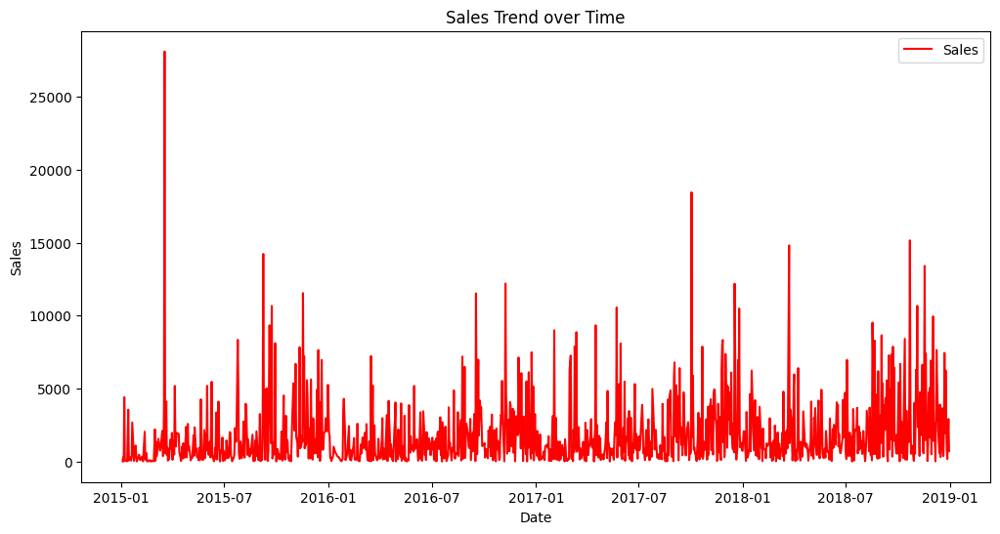
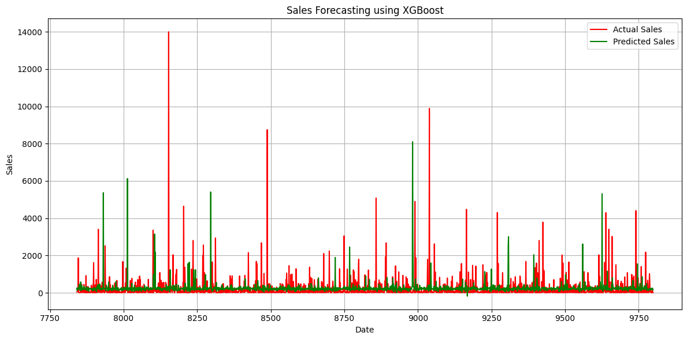

# Sales Forecast Prediction using XGBRegressor

A machine learning project that predicts sales using time series forecasting with XGBoost. This project demonstrates data preprocessing, feature engineering with lagged features, model training, and evaluation.

## Project Overview

This project leverages the **XGBRegressor** from the XGBoost library to forecast future sales based on historical sales data. The approach uses lagged features to capture temporal dependencies in the time series data.

## Features

- **Exploratory Data Analysis (EDA)**: Comprehensive analysis of sales data including distribution, trends, and missing values
- **Feature Engineering**: Creation of lagged features to capture temporal patterns
- **Time Series Forecasting**: XGBoost-based regression model for sales prediction
- **Model Evaluation**: Performance metrics (RMSE) and visualization of predictions
- **Visualization**: Time series plots showing actual vs. predicted sales

## Dataset

- **File**: `train.csv`
- **Features**: Order Date, Sales, and other relevant columns
- **Description**: Historical sales data used for training the forecast model

## Installation

### Requirements

```bash
pip install numpy pandas matplotlib seaborn xgboost scikit-learn
```

### Libraries Used

- **numpy**: Numerical computing
- **pandas**: Data manipulation and analysis
- **matplotlib & seaborn**: Data visualization
- **scikit-learn**: Machine learning utilities (train-test split, metrics)
- **xgboost**: Gradient boosting library for regression

## Project Structure

```
27-Salces Forecast Prediction/
├── README.md
├── train.csv
└── salce_forecast_prediction.ipynb
```

## Methodology

### 1. Data Preprocessing
- Load and explore the dataset
- Convert date columns to datetime format
- Group sales data by date

### 2. Feature Engineering
- Create lagged features (lag_1, lag_2, ..., lag_5)
- Use historical sales values as predictors
- Remove rows with missing values from lagged feature creation

### 3. Model Training
- Split data into training (80%) and testing (20%) sets
- Train XGBRegressor with the following parameters:
  - `objective`: reg:squarederror (squared error regression)
  - `n_estimators`: 100 trees
  - `learning_rate`: 0.1
  - `max_depth`: 5

### 4. Evaluation
- **Metric**: Root Mean Squared Error (RMSE)
- **Visualization**: Compare actual vs. predicted sales over time

## Results

The model predictions are evaluated and visualized to show how well the XGBRegressor captures sales trends. The RMSE value indicates the average prediction error.

## Usage

Run the Jupyter notebook to execute the complete pipeline:

```bash
jupyter notebook salce_forecast_prediction.ipynb
```

The notebook includes:
1. Data loading and exploration
2. Feature engineering with lagged variables
3. Model training
4. Predictions on test set
5. Model evaluation and visualization

## Key Insights

- **Lagged Features**: Past sales values are strong predictors of future sales
- **XGBoost Performance**: Effective for capturing non-linear relationships in sales data
- **Temporal Dependencies**: Sales show clear temporal patterns that can be forecasted

## Model Parameters

```python
XGBRegressor(
    objective='reg:squarederror',
    n_estimators=100,
    learning_rate=0.1,
    max_depth=5
)
```

## Future Improvements

- Experiment with different lag values
- Implement hyperparameter tuning (GridSearchCV, RandomizedSearchCV)
- Add additional features (seasonality, trend, external factors)
- Compare with other forecasting models (ARIMA, Prophet, LSTM)
- Implement cross-validation for more robust evaluation

## Author

Created as part of the 100 Machine Learning Projects series.

## License

This project is provided as-is for educational purposes.
