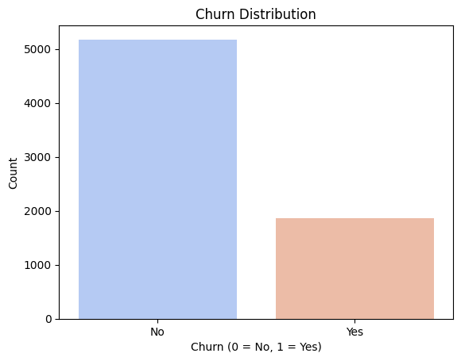
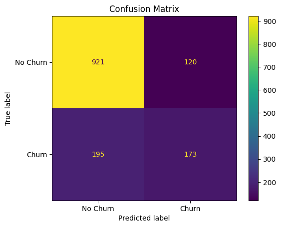
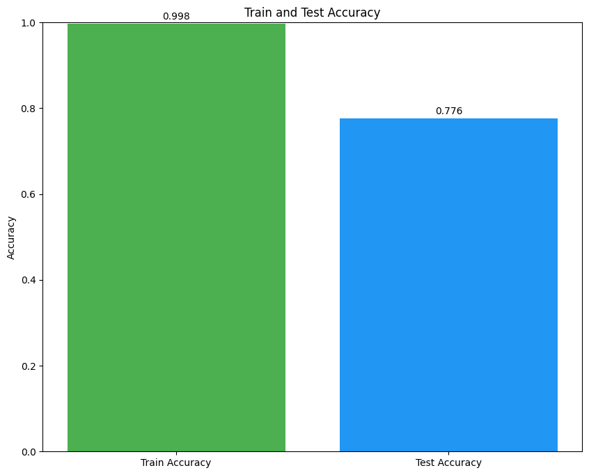

# Customer Churn Analysis Prediction

A machine learning project that predicts customer churn using the **Telco Customer Churn** dataset and a **Random Forest Classifier** in scikit-learn.

## 📌 Project Overview

Customer churn prediction helps businesses identify customers who are likely to stop using a service. This notebook walks through a complete supervised classification pipeline:

- Data loading
- Data preprocessing and cleaning
- Exploratory Data Analysis (EDA)
- Encoding categorical features
- Train/test split
- Feature scaling
- Model training (Random Forest)
- Prediction and evaluation
- Accuracy visualization

## 🎯 Problem Statement

Given customer demographic, account, and service usage information, predict whether a customer will churn:

- **Target column**: `Churn`
- **Task type**: Binary classification

## 🗂️ Dataset

- **File**: `Telco-Customer-Churn.csv`
- **Source used in notebook**: Downloaded via `wget` command and also included in this repository.

Typical fields include:

- Customer demographics (`gender`, `SeniorCitizen`, `Partner`, `Dependents`)
- Service subscriptions (`PhoneService`, `InternetService`, `StreamingTV`, etc.)
- Account and billing (`Contract`, `PaymentMethod`, `MonthlyCharges`, `TotalCharges`)
- Label (`Churn`)

## 🧪 Workflow Summary

1. **Import Libraries**
   - `numpy`, `pandas`, `matplotlib`, `seaborn`
   - Scikit-learn modules for preprocessing, modeling, and evaluation

2. **Load Data**
   - Read CSV into a pandas DataFrame.

3. **EDA & Data Cleaning**
   - Check shape, summary stats, info, null values
   - Visualize churn distribution with count plot
   - Convert `TotalCharges` to numeric and fill missing values with median

4. **Feature Engineering / Encoding**
   - Drop `customerID`
   - Encode categorical columns with `LabelEncoder`
   - Encode target `Churn`

5. **Split & Scale**
   - Train/test split (`test_size=0.2`, `random_state=0`)
   - Standardize features using `StandardScaler`

6. **Modeling**
   - Train `RandomForestClassifier`

7. **Evaluation**
   - Confusion matrix
   - Train accuracy and test accuracy
   - Accuracy comparison bar chart

## 📊 Visual Outputs

The notebook includes:

- Churn distribution plot

- Confusion matrix

- Train vs test accuracy bar chart


## 🛠️ Tech Stack

- Python 3
- Jupyter Notebook
- NumPy
- Pandas
- Matplotlib
- Seaborn
- Scikit-learn

## 🚀 How to Run

### Option 1: Jupyter Notebook (recommended)

1. Clone this repository.
2. Open the project folder.
3. Install dependencies:

```bash
pip install numpy pandas matplotlib seaborn scikit-learn jupyter
```

4. Launch notebook:

```bash
jupyter notebook
```

5. Open `customer_churn_analysis_prediction.ipynb` and run cells top to bottom.

### Option 2: VS Code

1. Install the Python and Jupyter extensions.
2. Open `customer_churn_analysis_prediction.ipynb`.
3. Select a Python kernel.
4. Run all cells sequentially.

## 📁 Project Structure

```text
28-Customer Churn Analysis Prediction/
├── customer_churn_analysis_prediction.ipynb
├── Telco-Customer-Churn.csv
└── README.md
```

## ✅ Current Model

- **Algorithm**: `RandomForestClassifier`
- **Evaluation**: confusion matrix + train/test accuracy

## 🔮 Possible Improvements

- Use `ColumnTransformer` + `Pipeline` for cleaner preprocessing
- Replace label encoding with one-hot encoding for nominal categories
- Handle class imbalance (if present) with class weights/SMOTE
- Hyperparameter tuning (`GridSearchCV` / `RandomizedSearchCV`)
- Add precision, recall, F1-score, ROC-AUC
- Model explainability with feature importance / SHAP

## 🤝 Contributing

Contributions are welcome. You can improve preprocessing, evaluation, visualization, or model performance and open a pull request.

## 📄 License

This project is open source and available under the **MIT License** (add a `LICENSE` file if you want to publish it with MIT terms).
