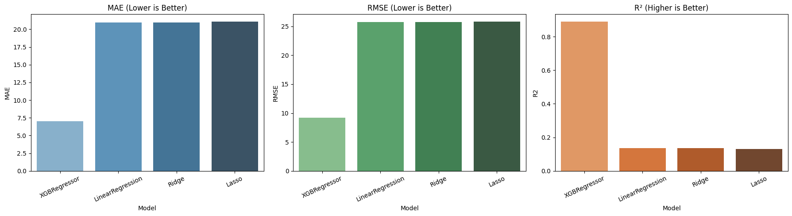

# Inventory Demand Forecasting

A machine learning project for forecasting inventory demand (sales) using multiple regression models in Scikit-learn and XGBoost.

## Project Structure

- `inventory_demand_forecasting.ipynb` — end-to-end workflow (EDA, feature engineering, training, prediction, evaluation)
- `train.csv` — training dataset

## Objective

Predict product sales demand from historical records and calendar-based features to support better stock planning.

## Workflow

1. **Data loading and exploration**
   - Basic shape/statistics/null checks
2. **Feature engineering**
   - Date decomposition (`year`, `month`, `day`)
   - `weekday`, `weekend`, holiday indicator for Kazakhstan (`KZ`)
   - Cyclical month features
3. **Preprocessing**
   - Outlier filtering
   - Train/test split
   - Feature scaling
4. **Model training**
   - Linear Regression
   - XGBoost Regressor
   - Lasso
   - Ridge
5. **Prediction and evaluation**
   - Comparison using MAE, RMSE, and R²
   - Visual performance plots

## Requirements

Install dependencies before running the notebook:

```bash
pip install numpy pandas matplotlib seaborn scikit-learn xgboost holidays
```

## How to Run

1. Open `inventory_demand_forecasting.ipynb`.
2. Run cells from top to bottom.
3. Review:
   - Model prediction preview table
   - Evaluation table (`MAE`, `RMSE`, `R2`)
   - Evaluation plots

## Metrics Used

- **MAE** (Mean Absolute Error): lower is better
- **RMSE** (Root Mean Squared Error): lower is better
- **R²** (Coefficient of Determination): higher is better

## Notes

- Holiday feature uses the `holidays` package with country code `KZ`.
- Reproducibility for split is controlled with `random_state=0`.

## License

For educational and portfolio use.