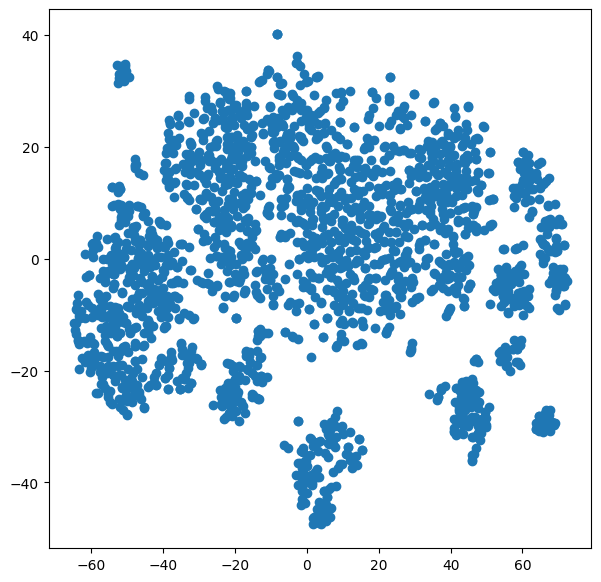
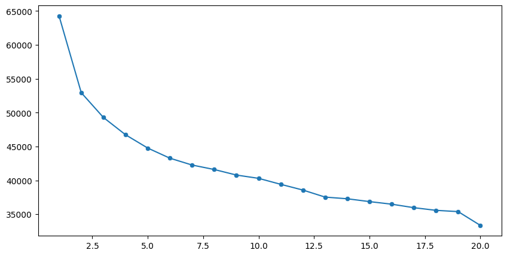
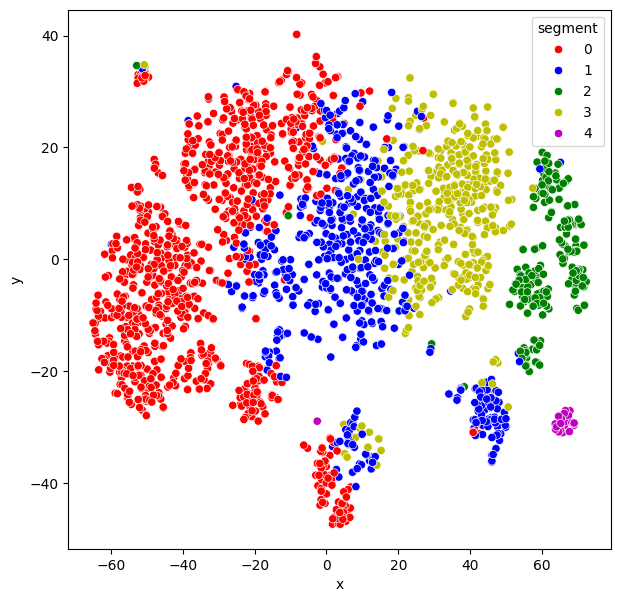

# Customer Segmentation using KMeans (Scikit-learn)

A complete end-to-end customer segmentation project built in Python using unsupervised learning.

This project:
- loads and preprocesses customer data,
- scales features,
- reduces dimensionality with t-SNE for visualization,
- finds customer groups using KMeans,
- visualizes segmented clusters.

## Project Files

- `customer_segmentation.ipynb` — full notebook workflow.
- `new.csv` — dataset used in the notebook.

## Problem Statement

Customer segmentation helps group customers with similar behaviors and characteristics. These segments can be used for:
- targeted marketing,
- personalized offers,
- better customer retention strategies.

## Workflow

1. **Import libraries** (`numpy`, `pandas`, `matplotlib`, `seaborn`, `scikit-learn`).
2. **Load dataset** from `new.csv`.
3. **Preprocess data**:
   - null-value checks and cleanup,
   - date feature extraction (`day`, `month`, `year`),
   - dropping unnecessary columns,
   - encoding categorical features with `LabelEncoder`.
4. **Feature scaling** using `StandardScaler`.
5. **Dimensionality reduction** using t-SNE to 2D.
6. **Model training** with KMeans.
7. **Elbow method** to inspect inertia across cluster counts.
8. **Final clustering and visualization** with color-coded segments.

## Tech Stack

- Python 3.x
- Pandas
- NumPy
- Matplotlib
- Seaborn
- Scikit-learn
- Jupyter Notebook (or VS Code Notebook)

## Installation

1. Clone the repository.
2. Navigate to this project folder.
3. Install dependencies:

```bash
pip install numpy pandas matplotlib seaborn scikit-learn jupyter
```

## How to Run

1. Open `customer_segmentation.ipynb` in Jupyter or VS Code.
2. Ensure `new.csv` is in the same folder as the notebook.
3. Run all cells in order.
4. Check:
   - elbow curve output,
   - final t-SNE scatter plot with segment colors.

## Results

The notebook produces:
- a KMeans-based segment assignment for each customer,
- 2D visual cluster representation (t-SNE),
- clear colored groups for segment interpretation.





## Notes

- Current notebook uses `n_clusters=5` for final model.
- You can tune cluster count, random seeds, and KMeans parameters for different segmentation behavior.
- Palette colors in the final plot can be customized through Seaborn `palette` mapping.

## Possible Improvements

- Compare KMeans with DBSCAN / Agglomerative clustering.
- Evaluate cluster quality with silhouette score.
- Add feature importance or profile summaries per segment.
- Export segment labels for downstream business use.

## Dataset Source

The notebook references this source for the CSV:
- https://media.githubusercontent.com/media/fatahrahimi330/100-Machine-Learning-Projects/refs/heads/master/30-Customer%20Segmentation/new.csv

## License

For personal learning and educational use.

If this project is part of a larger repository with a root license, use that license for distribution and reuse.
