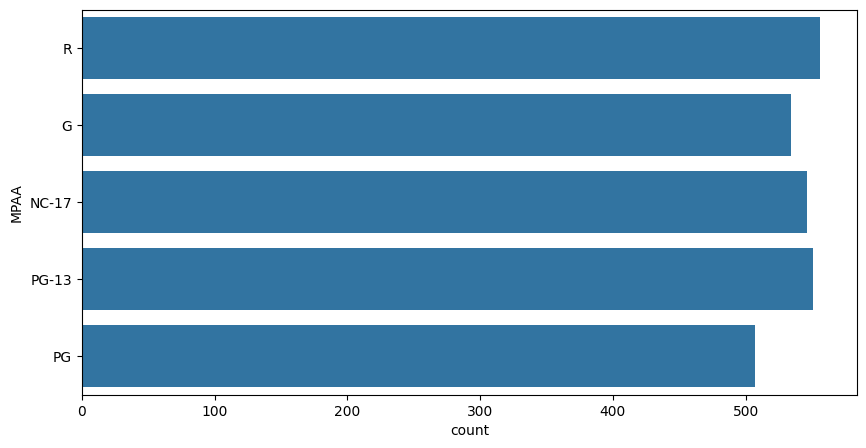
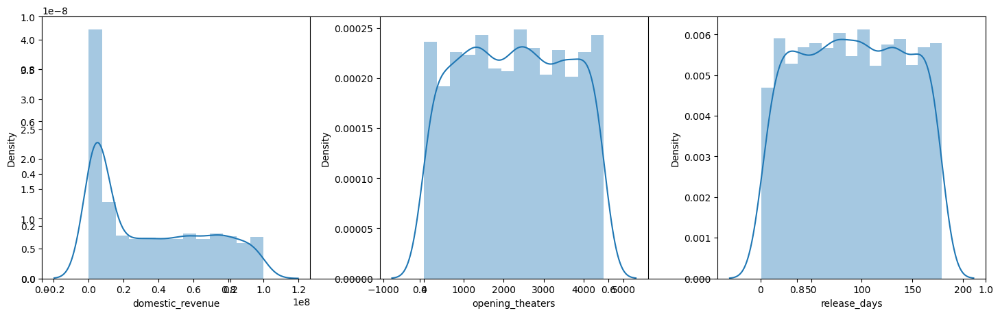
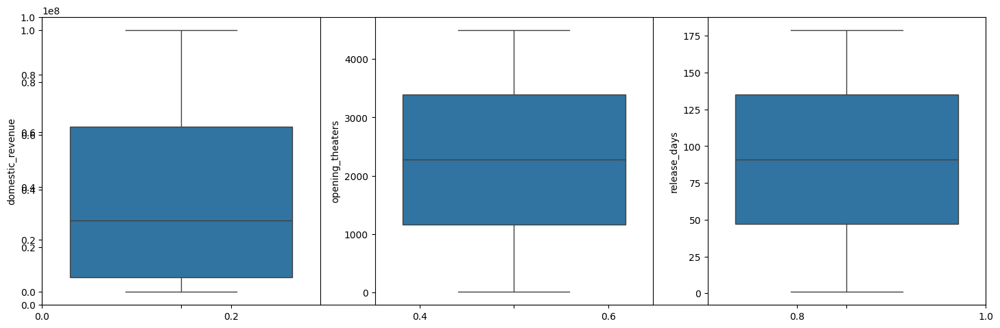
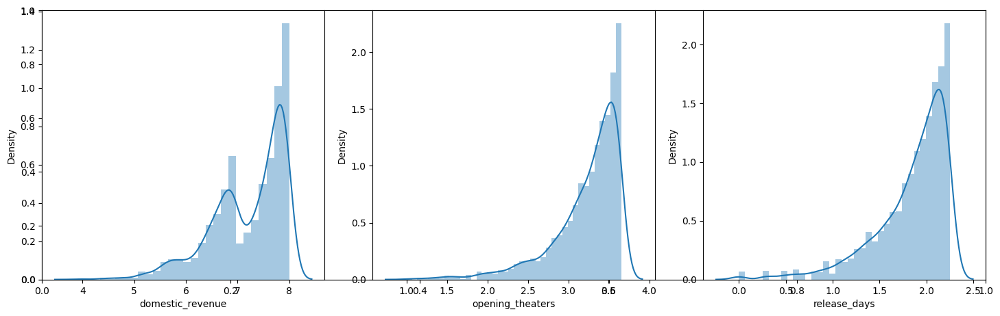
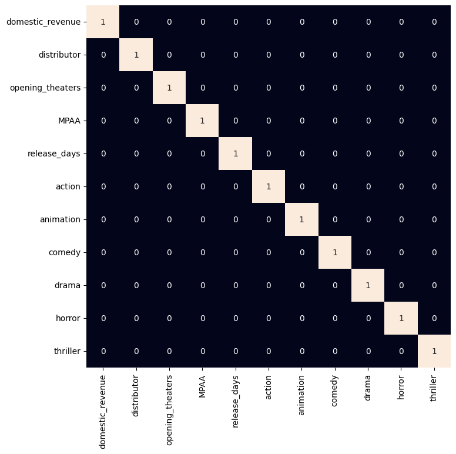
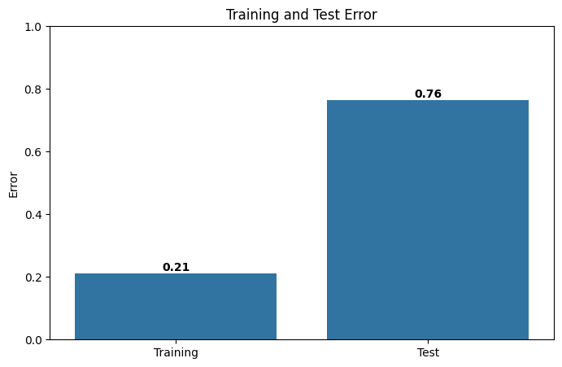

# Box Office Revenue Prediction

## Project Overview

This project implements a machine learning model to predict box office domestic revenue for movies using XGBoost regression. The model is trained on historical box office data and utilizes various features including movie metadata, theater information, and genre classifications.

## Dataset

**Source**: `boxoffice.csv`

### Features Used:
- **Opening Theaters**: Number of theaters where the movie opened
- **Release Days**: Number of days in release
- **MPAA Rating**: Motion Picture Association rating (G, PG, PG-13, R, etc.)
- **Genres**: Movie genres (vectorized using Count Vectorizer)
- **Distributor**: Movie distribution company (label encoded)

### Target Variable:
- **Domestic Revenue**: Total domestic box office revenue in dollars

### Removed Features:
- `world_revenue`: Not used for domestic prediction
- `opening_revenue`: Causes data leakage
- `budget`: Not available in the dataset

## Project Structure

```
32-Box Office Revenue Prediction/
├── box_office_revenue_prediction.ipynb
├── boxoffice.csv
└── README.md
```

## Installation & Requirements

### Dependencies:
```
numpy
pandas
matplotlib
seaborn
scikit-learn
xgboost
```

### Installation:
```bash
pip install numpy pandas matplotlib seaborn scikit-learn xgboost
```

## Usage

1. **Load the Jupyter Notebook**:
   ```bash
   jupyter notebook box_office_revenue_prediction.ipynb
   ```

2. **Run All Cells**: Execute all cells in sequence to:
   - Load and explore the dataset
   - Preprocess and clean the data
   - Train the XGBoost model
   - Evaluate model performance

## Project Workflow

### 1. **Data Loading & Exploration**
   - Load CSV file using pandas
   - Display basic dataset information
   - Check shape, describe, and data types

### 2. **Data Preprocessing**
   - **Remove unnecessary columns**: `world_revenue`, `opening_revenue`, `budget`
   - **Handle missing values**:
     - Fill missing MPAA and genres with mode values
     - Drop remaining null values
   - **Data type conversion**:
     - Remove dollar signs from revenue values
     - Remove commas from numeric columns
     - Convert to appropriate numeric types

### 3. **Exploratory Data Analysis (EDA)**
   - Visualize MPAA rating distribution
   - Analyze mean revenue by MPAA rating
   - Examine distributions of numeric features using histograms
   - Create box plots to identify outliers
   - Generate correlation heatmap

### 4. **Feature Engineering**
   - **Log transformation**: Apply log₁₀ transformation to:
     - `domestic_revenue` (target)
     - `opening_theaters`
     - `release_days`
   - This normalizes skewed distributions

### 5. **Feature Vectorization**
   - Use `CountVectorizer` to convert genre text to binary features
   - Remove sparse features (>95% zeros)

### 6. **Feature Encoding**
   - Label encode categorical variables:
     - `distributor`
     - `MPAA`

### 7. **Train-Test Split**
   - 90% training data, 10% test data
   - Random state: 22 for reproducibility

### 8. **Feature Scaling**
   - Apply StandardScaler to normalize features
   - Fit on training data, transform both train and test sets

### 9. **Model Training**
   - Algorithm: XGBoost Regressor
   - Default hyperparameters
   - Trained on scaled features

### 10. **Model Evaluation**
   - Metric: Mean Absolute Error (MAE)
   - Compare training vs. test error to assess overfitting
   - Visualize errors with bar chart and value labels

## Model Performance

The model evaluates performance using Mean Absolute Error (MAE):
- **Training Error**: Error on training dataset
- **Test Error**: Error on unseen test data

Lower values indicate better model performance. Significant difference between training and test error may indicate overfitting.

## Key Findings

1. **Log-transformed features** provide better model performance by handling skewed distributions
2. **XGBoost** effectively captures non-linear relationships in box office data
3. **Genre information** is valuable for revenue prediction when properly vectorized
4. **Theater count and release duration** are strong predictors of revenue

## Visualizations

The notebook generates the following visualizations:
- MPAA rating distribution
- Feature distribution histograms (before and after log transformation)
- Box plots for outlier detection
- Correlation heatmap for feature relationships
- Training vs. Test error comparison bar chart






## Future Improvements

1. **Hyperparameter Tuning**: Optimize XGBoost parameters using GridSearchCV or RandomizedSearchCV
2. **Feature Engineering**: Create interaction features or polynomial features
3. **Model Comparison**: Test other algorithms (Random Forest, Gradient Boosting, Neural Networks)
4. **Cross-Validation**: Implement k-fold cross-validation for robust evaluation
5. **Additional Features**: Include seasonal information, release timing, or marketing data
6. **Error Analysis**: Investigate predictions with highest errors to identify patterns

## Notes

- The model uses log-transformed target variable, so predictions should be reverse-transformed (10^prediction) to get actual revenue values
- The StandardScaler should be fit only on training data to prevent data leakage
- Random state (22) ensures reproducible results across runs

## Author

Machine Learning Project Series - Project 32

## License

Open source - Feel free to use and modify for educational purposes

---

**Last Updated**: March 2026
