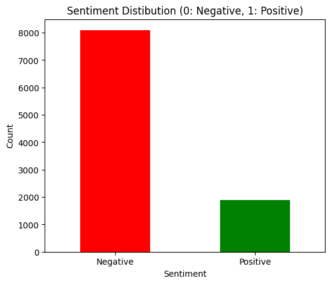
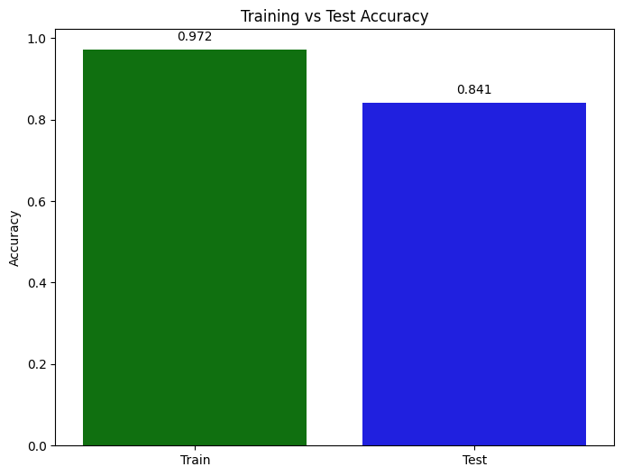
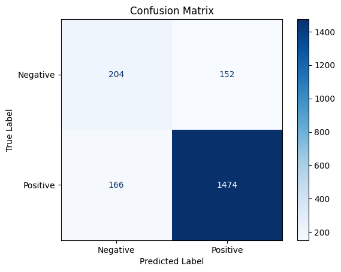

# Flipkart Reviews Sentiment Analysis

End-to-end sentiment analysis project on Flipkart product reviews using NLP preprocessing, TF-IDF vectorization, and a Decision Tree classifier.

## Project Structure

- [flipkart_reviews_sentiment_analysis.ipynb](flipkart_reviews_sentiment_analysis.ipynb) — full notebook workflow (EDA → preprocessing → modeling → evaluation)
- [flipkart_data.csv](flipkart_data.csv) — dataset used in the notebook

## Objective

Classify customer reviews into:
- **Positive (1)** for ratings >= 4
- **Negative (0)** for ratings < 4



## Workflow

1. **Import libraries**
   - `numpy`, `pandas`, `matplotlib`, `seaborn`
   - `nltk` (stopwords)
   - `wordcloud`
   - `scikit-learn`

2. **Load dataset**
   - Reads review data from [flipkart_data.csv](flipkart_data.csv)

3. **Preprocess text**
   - Lowercase conversion
   - Stopword removal
   - Binary sentiment label creation from ratings

4. **Exploratory Data Analysis (EDA)**
   - Sentiment distribution plot
   - Rating distribution plot
   - Positive review word cloud

5. **Feature Engineering**
   - `TfidfVectorizer(max_features=500)` to convert text into numerical features

6. **Train/Test split**
   - `train_test_split(test_size=0.2, random_state=42)`

7. **Modeling**
   - `DecisionTreeClassifier(random_state=42)`

8. **Evaluation**
   - Training accuracy and test accuracy
   - Accuracy comparison bar chart
   - Confusion matrix with class labels
   
   
   

## Requirements

Install dependencies before running the notebook:

```bash
pip install numpy pandas matplotlib seaborn nltk wordcloud scikit-learn
```

Also ensure NLTK stopwords are downloaded (already included in the notebook):

```python
import nltk
nltk.download('stopwords')
```

## How to Run

1. Open [flipkart_reviews_sentiment_analysis.ipynb](flipkart_reviews_sentiment_analysis.ipynb) in Jupyter Notebook, JupyterLab, or VS Code.
2. Run cells from top to bottom in order.
3. Review:
   - Data exploration outputs
   - Training vs test performance
   - Confusion matrix

## Notes

- The model is intentionally simple for learning and baseline performance.
- You can improve performance by trying:
  - `LogisticRegression`
  - `LinearSVC`
  - `RandomForestClassifier`
  - Hyperparameter tuning (`GridSearchCV`)
  - Better text cleaning (lemmatization/stemming, n-grams)

## Future Improvements

- Add precision, recall, F1-score, ROC-AUC
- Handle class imbalance if present
- Save model/vectorizer with `joblib`
- Build an inference script or small web app for live predictions

## Author

Fatah Rahimi
