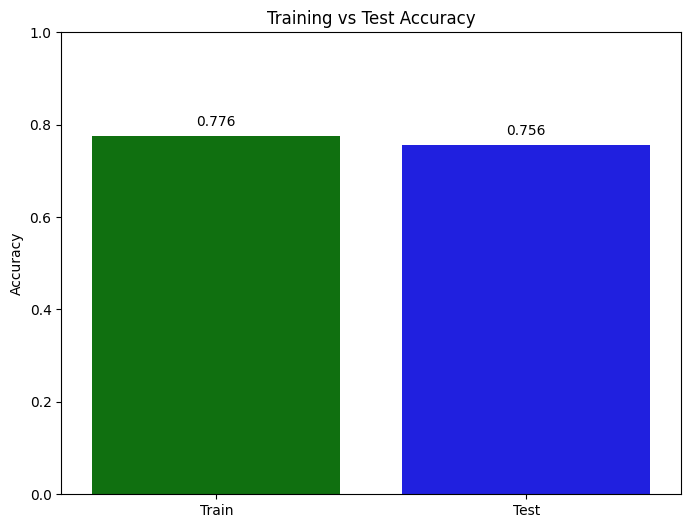
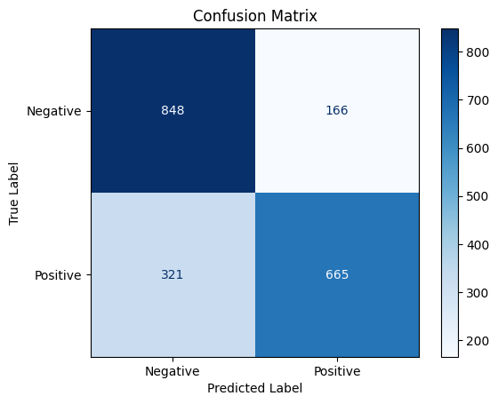

# Click-Through Rate Prediction

Predict whether a user will click an online ad using an ensemble-based XGBoost model.

This project is part of the **100+ Machine Learning Projects** series and includes:
- A cleaned tabular dataset (`ad_10000records.csv`)
- A full end-to-end notebook (`click_through_rate_prediction.ipynb`)

---

## Project Overview

Click-Through Rate (CTR) prediction is a binary classification problem where the goal is to estimate whether a user clicks an ad (`1`) or not (`0`).

In this project, the workflow covers:
1. Data loading
2. Exploratory data analysis (EDA)
3. Preprocessing and encoding
4. Train-test split
5. Model training with `XGBRFClassifier`
6. Evaluation with accuracy and confusion matrix

---

## Dataset

- **File:** `ad_10000records.csv`
- **Size:** 10,000 rows
- **Target column:** `Clicked on Ad`

The dataset contains user and session-level ad interaction features (for example demographics, browsing behavior, and ad-related context) used to predict ad clicks.

---

## Tech Stack

- Python 3.x
- NumPy
- Pandas
- Matplotlib
- Seaborn
- scikit-learn
- XGBoost

---

## Project Structure

```text
34-Click-Through Rate Prediction/
├── ad_10000records.csv
├── click_through_rate_prediction.ipynb
└── README.md
```

---

## Installation

Clone the repository and move to this project folder:

```bash
git clone https://github.com/<your-username>/100-Machine-Learning-Projects.git
cd "100-Machine-Learning-Projects/34-Click-Through Rate Prediction"
```

Install dependencies:

```bash
pip install numpy pandas matplotlib seaborn scikit-learn xgboost jupyter
```

---

## How to Run

1. Open Jupyter Notebook:

	```bash
	jupyter notebook
	```

2. Open `click_through_rate_prediction.ipynb`.
3. Run all cells from top to bottom.

---

## Notebook Pipeline

### 1) Import Libraries
Loads standard scientific Python and visualization libraries.

### 2) Load Dataset
Reads `ad_10000records.csv` and previews sample rows.

### 3) Data Preprocessing
- Dataset inspection (`shape`, `describe`, `info`)
- Class distribution of `Clicked on Ad`
- CTR percentage calculation
- Label encoding for `Gender`

### 4) Train/Test Split
- Feature preparation with selected columns
- Drops text-heavy columns: `Ad Topic Line`, `City`
- Splits data into train and test sets (`test_size=0.2`, `random_state=42`)

### 5) Model Training
Trains `XGBRFClassifier` (XGBoost Random Forest Classifier) with a fixed random seed.

### 6) Evaluation
- Training accuracy
- Test accuracy
- Accuracy comparison bar chart
- Confusion matrix with labeled classes

---

## Results

The notebook prints:
- `Training Accuracy`
- `Test Accuracy`

It also visualizes performance with:
- Train vs Test accuracy bar chart
- Confusion matrix heatmap




> Run the notebook to reproduce exact metric values in your environment.

---

## Reproducibility Notes

- Random seed is set to `42` in train-test split and model initialization for consistent runs.
- Keep package versions stable for near-identical results.

---

## Future Improvements

- Add cross-validation
- Perform hyperparameter tuning (`GridSearchCV` / `RandomizedSearchCV`)
- Add additional metrics (Precision, Recall, F1, ROC-AUC)
- Build a deployable inference script or API endpoint
- Add feature importance analysis (e.g., SHAP)

---

## Contributing

Contributions are welcome. You can:
1. Fork the repository
2. Create a feature branch
3. Commit your changes
4. Open a pull request

---

## Acknowledgment

This project is part of a broader machine learning practice collection focused on practical, end-to-end implementations.

