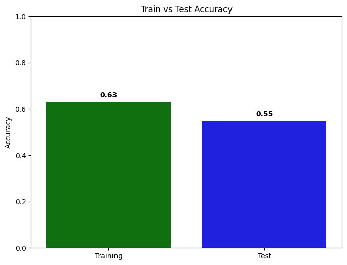
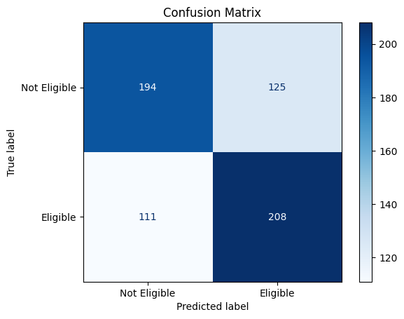
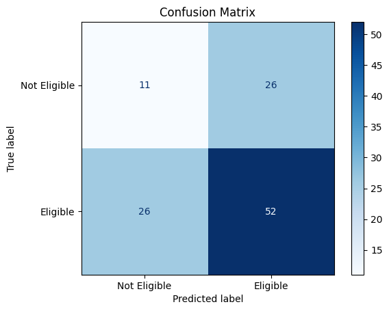

# Loan Eligibility Prediction (SVM)

This project predicts loan eligibility using a **Support Vector Machine (SVM)** classifier built with scikit-learn.

## 📌 Project Overview
The notebook walks through a complete machine learning workflow:
- Data loading
- Exploratory Data Analysis (EDA)
- Data preprocessing and label encoding
- Handling class imbalance with oversampling
- Train/test split
- Feature scaling
- Model training with SVM (RBF kernel)
- Evaluation using accuracy and confusion matrix

## 📂 Files
- `loan_eligibility_prediction.ipynb` — Main notebook containing all steps
- `loan_data.csv` — Dataset used for training and evaluation

## 🛠️ Tech Stack
- Python
- NumPy
- Pandas
- Matplotlib
- Seaborn
- scikit-learn
- imbalanced-learn

## 🚀 How to Run
1. Clone the repository.
2. Install dependencies:
   ```bash
   pip install numpy pandas matplotlib seaborn scikit-learn imbalanced-learn jupyter
   ```
3. Open the notebook:
   ```bash
   jupyter notebook loan_eligibility_prediction.ipynb
   ```
4. Run all cells in order.

## 📊 Model Evaluation
The project evaluates performance with:
- Training accuracy
- Test accuracy
- Confusion matrix visualization
- Accuracy comparison bar chart





## ✅ Notes
- Oversampling is used on training data to reduce class imbalance.
- Standard scaling is applied before training the SVM model.

---
If you find this project useful, consider giving it a ⭐ on GitHub.
