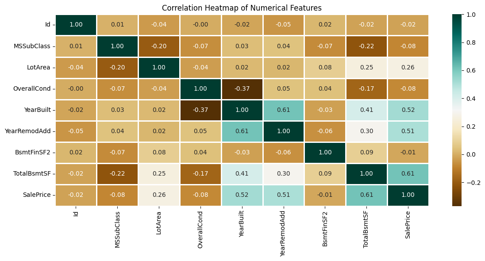
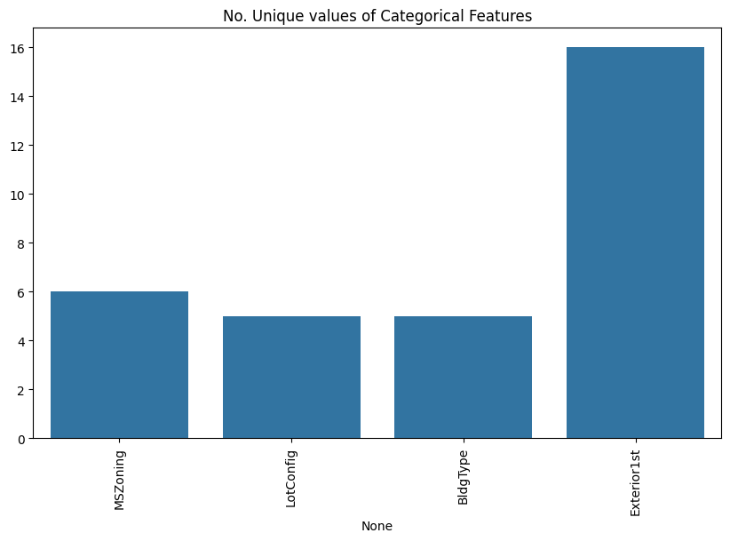
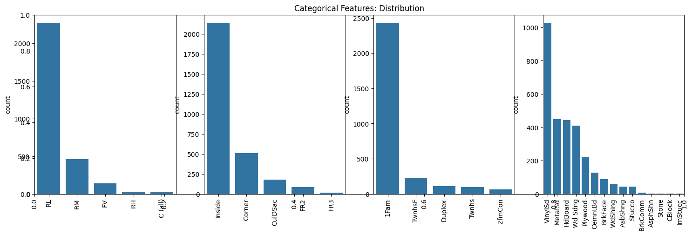
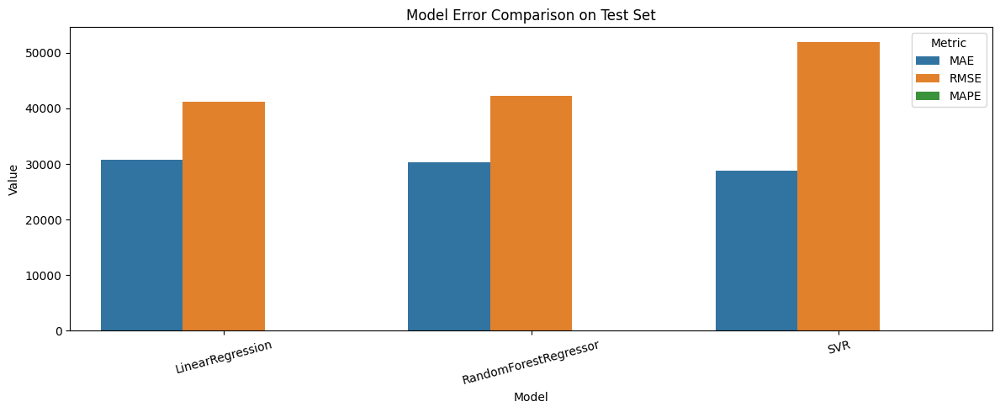
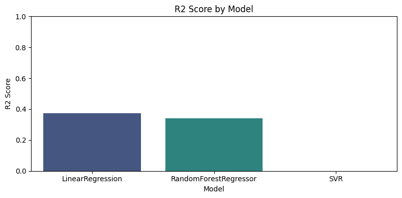
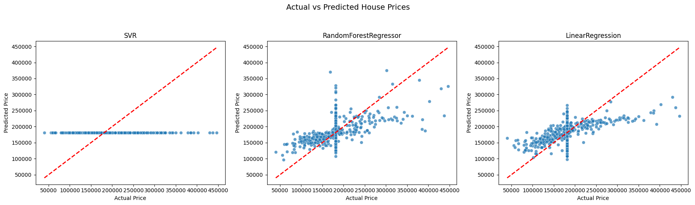

# House Price Prediction

A machine learning project for predicting house sale prices using multiple regression models in Scikit-learn.

This project includes end-to-end steps:
- Data loading
- Exploratory Data Analysis (EDA)
- Data cleaning
- Feature encoding
- Train/test split
- Model training
- Prediction and evaluation
- Visualization of model performance

## Models Used

- `SVR` (Support Vector Regressor)
- `RandomForestRegressor`
- `LinearRegression`

## Dataset

The dataset file used in this project:

- `HousePricePrediction.xlsx`

It can be downloaded from the original source used in the notebook:

- https://raw.githubusercontent.com/fatahrahimi330/100-Machine-Learning-Projects/master/37-House%20Price%20Prediction/HousePricePrediction.xlsx

## Project Structure

- `house_price_prediction.ipynb` → Main notebook containing the full workflow
- `HousePricePrediction.xlsx` → Input dataset

## Workflow

### 1) Import Libraries
Key libraries:
- `numpy`
- `pandas`
- `matplotlib`
- `seaborn`
- `scikit-learn`

### 2) Load Dataset
The dataset is downloaded and loaded with `pandas.read_excel()`.

### 3) Data Preprocessing
Includes:
- Checking shape and summary statistics
- Null value analysis
- Data type split (`object`, `int64`, `float64`)
- Correlation heatmap for numerical features
- Categorical feature distribution plots

### 4) Data Cleaning
- Drops `Id` column
- Fills missing values in `SalePrice` with mean
- Removes remaining missing-value rows

### 5) Feature Encoding
- One-hot encoding with `OneHotEncoder`
- Merges encoded categorical features into final training dataframe

### 6) Train/Test Split
- Splits data into train and test sets using `train_test_split`
- Current split: 80% train / 20% test

### 7) Build and Train Models
Trains each model and reports training error (MAPE).

### 8) Make Predictions
Runs predictions on `X_test` and compares sample actual vs predicted values.

### 9) Evaluate Models
Metrics used:
- `MAE` (Mean Absolute Error)
- `RMSE` (Root Mean Squared Error)
- `MAPE` (Mean Absolute Percentage Error)
- `R2 Score`

## Visualizations Included

The notebook produces:
- Correlation heatmap
- Categorical feature distribution charts
- Model error comparison bar chart (`MAE`, `RMSE`, `MAPE`)
- `R2 Score` comparison chart
- Actual vs Predicted scatter plots for each model







## How to Run

### Option 1: Jupyter Notebook
1. Open `house_price_prediction.ipynb`.
2. Run cells from top to bottom.

### Option 2: VS Code Notebook
1. Open this folder in VS Code.
2. Open `house_price_prediction.ipynb`.
3. Select a Python environment with required packages.
4. Run all cells.

## Requirements

Install dependencies:

```bash
pip install numpy pandas matplotlib seaborn scikit-learn openpyxl
```

> `openpyxl` is required for reading `.xlsx` files with pandas.

## Example Evaluation Output

The notebook creates a dataframe similar to:

| Model | MAE | RMSE | MAPE | R2 Score |
|------|-----:|-----:|-----:|---------:|
| RandomForestRegressor | ... | ... | ... | ... |
| LinearRegression | ... | ... | ... | ... |
| SVR | ... | ... | ... | ... |

(Exact values depend on data split and preprocessing state.)

## Future Improvements

- Add cross-validation for robust comparison
- Hyperparameter tuning (`GridSearchCV` / `RandomizedSearchCV`)
- Save the best model with `joblib`
- Add feature importance analysis
- Convert notebook pipeline into reusable Python scripts

## Author

**Fatah Rahimi**

GitHub: https://github.com/fatahrahimi330

---

If you found this project useful, consider giving it a ⭐ on GitHub.