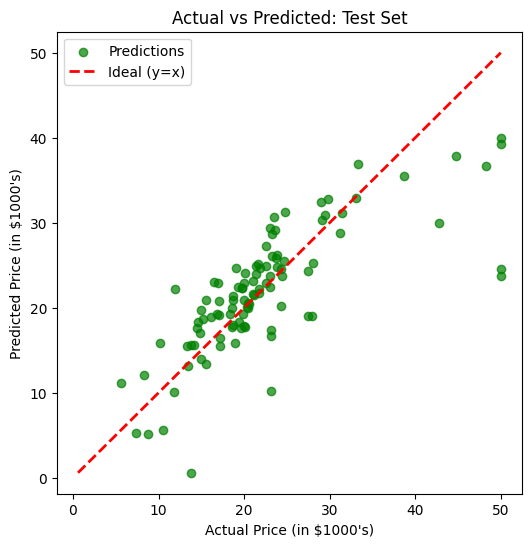
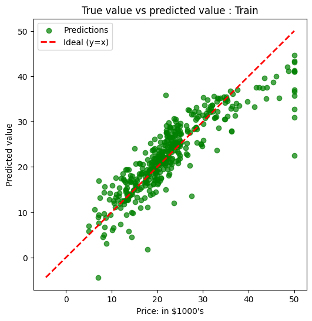

# Boston House Price Prediction (Linear Regression)

A beginner-friendly machine learning project that predicts Boston house prices using **Linear Regression** with the **Boston Housing dataset** loaded via `fetch_openml`.

## Table of Contents
- [Project Overview](#project-overview)
- [Dataset](#dataset)
- [Tech Stack](#tech-stack)
- [Project Structure](#project-structure)
- [Workflow](#workflow)
- [Results](#results)
- [Visualizations](#visualizations)
- [How to Run](#how-to-run)
- [Troubleshooting](#troubleshooting)
- [Future Improvements](#future-improvements)
- [License](#license)

## Project Overview
This notebook walks through a complete supervised regression pipeline:
1. Import libraries
2. Load dataset
3. Preprocess data
4. Split into train/test sets
5. Train a Linear Regression model
6. Evaluate predictions with error metrics
7. Visualize actual vs predicted values

## Dataset
- **Source**: OpenML (`name='boston', version=1`)
- **Features**: 13 housing-related input variables
- **Target**: `Price` (median house value, in $1000s)
- **Rows**: 506 samples (after numeric conversion and cleanup)

> Note: The Boston Housing dataset is widely used for learning, but it has known ethical and methodological limitations. Prefer modern housing datasets for production use.

## Tech Stack
- Python
- NumPy
- Pandas
- Matplotlib
- Seaborn
- Scikit-learn
- Jupyter Notebook

## Project Structure
```text
38-Boston House Dataset/
├── boston_house_dataset.ipynb
└── README.md
```

## Workflow
### 1) Data Loading
- Load Boston dataset from OpenML
- Convert to DataFrame

### 2) Data Preprocessing
- Add target column `Price`
- Convert all columns to numeric using `pd.to_numeric(..., errors='coerce')`
- Drop invalid rows with missing/failed numeric conversion

### 3) Train-Test Split
- Features: all columns except `Price`
- Target: `Price`
- Split ratio: 80% train / 20% test
- `random_state=0` for reproducibility

### 4) Model Training
- Model: `LinearRegression()`
- Fit on training data

### 5) Evaluation
- Compute:
  - Mean Squared Error (MSE)
  - Mean Absolute Error (MAE)
- Plot test predictions against actual values with ideal reference line `y=x`

## Results
From the notebook run:
- **MSE**: `33.44897999767639`
- **MAE**: `3.8429092204444983`

Interpretation:
- Lower values indicate better fit.
- MAE suggests the average prediction error is about **3.84** thousand dollars.

## Visualizations
The notebook includes:
- **Test set**: scatter plot of actual vs predicted values + ideal dashed line (`y=x`)
- **Train set**: scatter plot of actual vs predicted values

These plots help check how close predictions are to perfect estimates.




## How to Run
### 1) Clone the repository
```bash
git clone <your-repo-url>
cd "38-Boston House Dataset"
```

### 2) Install dependencies
```bash
pip install numpy pandas matplotlib seaborn scikit-learn jupyter
```

### 3) Start Jupyter
```bash
jupyter notebook
```

### 4) Open and run
Open `boston_house_dataset.ipynb` and run cells from top to bottom.

## Troubleshooting
### TypeError during prediction
If you see:

`TypeError: can't multiply sequence by non-int of type 'float'`

Cause: one or more feature columns are non-numeric.

Fix used in this project:
- Convert columns to numeric
- Drop rows with conversion failures (`NaN`)
- Rebuild `X` and `y` from cleaned DataFrame before splitting

### Plot issue with `plt.plot(y_test, y_pred)`
Direct line plotting can be misleading because points are not sorted pairs for a curve.
Use:
- `plt.scatter(y_test, y_pred)` for prediction points
- a separate ideal line `y=x` for reference

## Future Improvements
- Add `R²`, `RMSE`, and cross-validation
- Compare multiple regressors (Random Forest, XGBoost, SVR)
- Add feature scaling and residual analysis
- Package as a reusable training script

## License
This project is for educational purposes. Add an open-source license (e.g., MIT) if publishing publicly.
