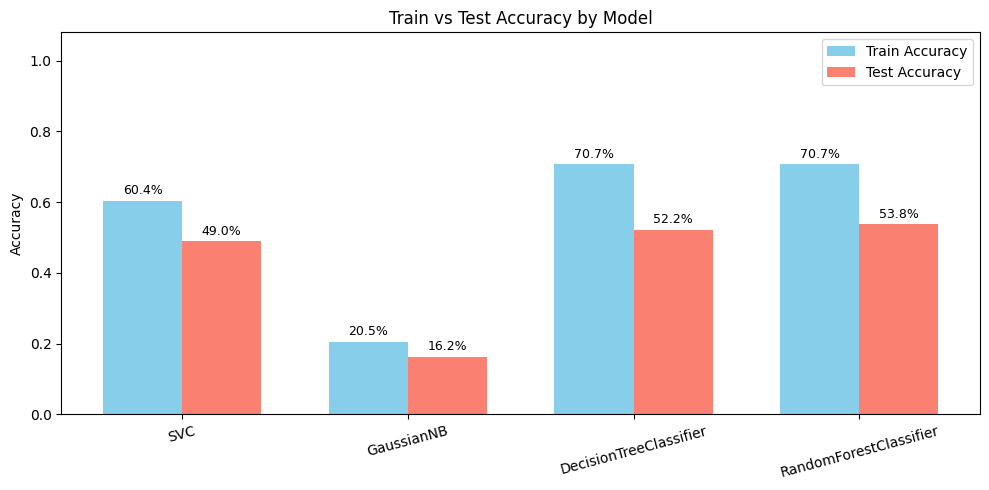

# Disease Prediction (Machine Learning)

A multi-class disease prediction project built with Scikit-learn models in a Jupyter Notebook.

This project uses symptom-based features to predict disease classes and compares the performance of multiple classifiers.

## Project Structure

- `disease_prediction.ipynb` - complete end-to-end notebook (data loading, preprocessing, training, evaluation, visualization)
- `improved_disease_dataset.csv` - dataset used for training and testing

## Dataset

- **Rows:** 2000
- **Columns:** 11
- **Features (10):**
  - `fever`
  - `headache`
  - `nausea`
  - `vomiting`
  - `fatigue`
  - `joint_pain`
  - `skin_rash`
  - `cough`
  - `weight_loss`
  - `yellow_eyes`
- **Target:** `disease`

The notebook encodes disease labels with `LabelEncoder` and balances class distribution using `RandomOverSampler`.

## Models Used

- `SVC`
- `GaussianNB`
- `DecisionTreeClassifier`
- `RandomForestClassifier`

## Workflow

1. Import libraries
2. Load CSV dataset
3. Perform basic EDA (`shape`, `describe`, `info`, class distribution plot)
4. Encode labels
5. Split features and target
6. Handle class imbalance with oversampling
7. Train-test split (`test_size=0.2`, `random_state=42`)
8. Train models and evaluate train/test accuracy
9. Visualize confusion matrices
10. Plot train vs test accuracy as a bar chart (with percentage labels)

## Results

Based on the current notebook run:

| Model | Train Accuracy | Test Accuracy |
|---|---:|---:|
| SVC | 0.604 | 0.490 |
| GaussianNB | 0.205 | 0.162 |
| DecisionTreeClassifier | 0.707 | 0.522 |
| RandomForestClassifier | 0.707 | 0.538 |



## Requirements

Install these Python packages:

- `numpy`
- `pandas`
- `matplotlib`
- `seaborn`
- `scikit-learn`
- `imbalanced-learn`
- `jupyter`

You can install them with:

```bash
pip install numpy pandas matplotlib seaborn scikit-learn imbalanced-learn jupyter
```

## How to Run

1. Clone this repository:

```bash
git clone https://github.com/<your-username>/<your-repo-name>.git
cd <your-repo-name>
```

2. Launch Jupyter Notebook:

```bash
jupyter notebook
```

3. Open `disease_prediction.ipynb`.
4. Run all cells in order.

## Visual Outputs

The notebook includes:

- Class distribution plots (before and after oversampling)
- Confusion matrix for training predictions
- Confusion matrix for test predictions
- Grouped bar plot of train vs test accuracy with percentage labels

## Notes

- This project is for educational and experimentation purposes.
- Predictions are based on the provided dataset features and should not be used as real medical diagnosis.

## Future Improvements

- Add cross-validation and hyperparameter tuning (`GridSearchCV` / `RandomizedSearchCV`)
- Add classification report (`precision`, `recall`, `f1-score`) per class
- Save and load the best model with `joblib`
- Build a simple Streamlit or Flask web app interface
- Add reproducible environment setup (`requirements.txt` or `environment.yml`)

## License

You can use an MIT License for open-source usage (add a `LICENSE` file if needed).
