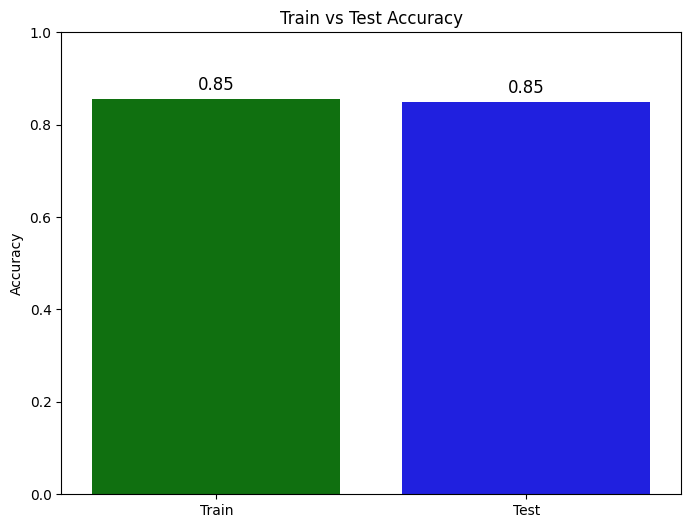
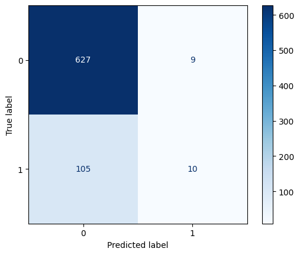

# Heart Disease Prediction

A machine learning project that predicts the risk of coronary heart disease (`TenYearCHD`) using **Logistic Regression** and the Framingham Heart Study dataset.

## Project Overview

This project walks through a complete binary classification workflow in a Jupyter Notebook:

- Load and inspect the heart disease dataset
- Clean and preprocess data
- Split into train and test sets
- Scale features with `StandardScaler`
- Train a `LogisticRegression` model
- Evaluate model performance with accuracy metrics

The notebook used in this repository: `HeartDiseasePrediction.ipynb`.

## Dataset

- File: `framingham.csv`
- Source in notebook: a raw GitHub URL pointing to the same dataset
- Total rows before cleaning: **4240**
- Columns before cleaning: **16**
- Target variable: `TenYearCHD` (0 = No risk, 1 = Risk)

### Data Cleaning Steps

1. Dropped the `education` column.
2. Renamed `male` to `Sex_male`.
3. Dropped rows with missing values.

After cleaning:

- Total rows: **3751**
- Class distribution:
  - `0`: 3179
  - `1`: 572

## Features Used

The model is trained on these 6 features:

- `age`
- `Sex_male`
- `cigsPerDay`
- `totChol`
- `sysBP`
- `glucose`

## Model Pipeline

1. **Train-test split**
   - `test_size=0.2`
   - `random_state=4`
   - Train shape: `(3000, 6)`
   - Test shape: `(751, 6)`
2. **Feature scaling**
   - `StandardScaler` fitted on train data and applied to test data
3. **Model training**
   - `LogisticRegression()` from scikit-learn
4. **Prediction**
   - Predictions on both train and test sets
5. **Evaluation**
   - `accuracy_score` for train and test accuracy

## Results

- **Train Accuracy:** `0.855`
- **Test Accuracy:** `0.848`



These scores suggest decent generalization with a small train-test gap.

## Tech Stack

- Python
- NumPy
- Pandas
- Matplotlib
- Seaborn
- scikit-learn
- Jupyter Notebook

## Project Structure

```text
41-Heart Disease Prediction/
├── HeartDiseasePrediction.ipynb
├── framingham.csv
└── README.md
```

## Installation and Usage

### 1) Clone the repository

```bash
git clone <your-repo-url>
cd "41-Heart Disease Prediction"
```

### 2) Install dependencies

```bash
pip install numpy pandas matplotlib seaborn scikit-learn jupyter
```

### 3) Run the notebook

```bash
jupyter notebook HeartDiseasePrediction.ipynb
```

## Notes

- The notebook currently loads the dataset from a GitHub URL. You can switch to local loading (`framingham.csv`) for offline use.
- There are minor seaborn `FutureWarning` messages related to `palette` usage in plots. They do not affect model training or results.

## Future Improvements

- Handle class imbalance (for example, class weights or resampling)
- Evaluate more metrics (precision, recall, F1-score, ROC-AUC)
- Add confusion matrix and classification report visualization
- Try additional models (Random Forest, XGBoost, SVM)
- Use cross-validation and hyperparameter tuning

## License

This project is open-source and available under the MIT License (or your preferred license).

