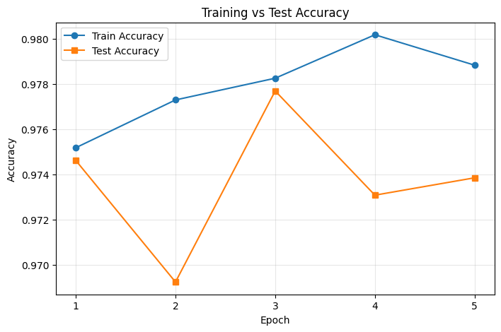
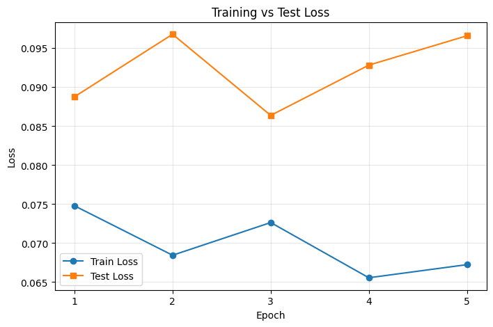
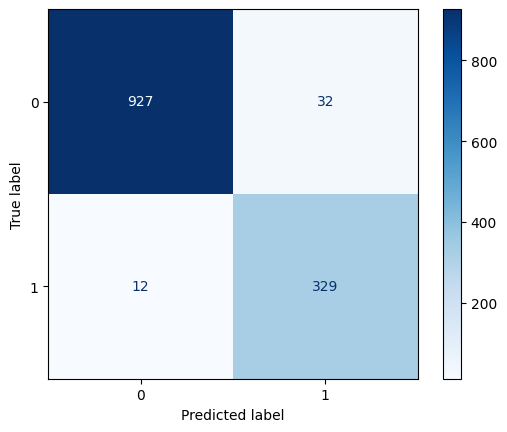

# Wine Quality Prediction (ANN with TensorFlow)

This project builds an Artificial Neural Network (ANN) to classify wine type (**Red** or **White**) using physicochemical features from the Wine Quality datasets.

The model is trained with TensorFlow/Keras and evaluated using accuracy, confusion matrix, and training curves (accuracy/loss).

---

## Project Structure

```text
42-Wine Quality Prediction/
├── wine_quality_prediction.ipynb
├── redwinequality.csv
├── whitewinequality.csv
└── README.md
```

---

## Dataset

Two CSV files are used:

- `redwinequality.csv`
- `whitewinequality.csv`

Each row contains numeric wine attributes (for example acidity, sugar, alcohol, etc.).  
For this project:

- Red wine is labeled as `type = 1`
- White wine is labeled as `type = 0`

Then both datasets are merged into one dataframe for binary classification.

---

## Workflow

1. Import required libraries (`numpy`, `pandas`, `matplotlib`, `seaborn`, `tensorflow`, `sklearn`)
2. Load red/white datasets and add binary labels
3. Merge datasets and clean missing values
4. Exploratory visualization (alcohol distribution by wine type)
5. Train-test split (`test_size=0.2`, `random_state=42`)
6. Build ANN model
7. Train model with validation on test set
8. Plot:
   - Training vs test accuracy
   - Training vs test loss
9. Make predictions on test set
10. Evaluate with accuracy and confusion matrix

---

## Model Architecture

The neural network is defined as:

- Dense layer: 12 units, `relu`
- Dense layer: 9 units, `relu`
- Output layer: 1 unit, `sigmoid`

Compile settings:

- Loss: `binary_crossentropy`
- Optimizer: `adam`
- Metric: `accuracy`

Training settings:

- Epochs: `5`
- Batch size: `1`
- Validation data: `(X_test, y_test)`

---

## Results

From the notebook run:

- Final test accuracy is approximately **0.97**

You can also inspect:

- Accuracy curve: training vs validation accuracy per epoch
- Loss curve: training vs validation loss per epoch
- Confusion matrix for class-wise performance




---

## Installation and Setup

### 1) Clone repository

```bash
git clone <your-repo-url>
cd "42-Wine Quality Prediction"
```

### 2) (Recommended) Create a virtual environment

```bash
python -m venv .venv
source .venv/bin/activate
```

### 3) Install dependencies

```bash
pip install numpy pandas matplotlib seaborn scikit-learn tensorflow jupyter
```

### 4) Launch Jupyter Notebook

```bash
jupyter notebook
```

Open `wine_quality_prediction.ipynb` and run cells top-to-bottom.

---

## How to Run

1. Open `wine_quality_prediction.ipynb`
2. Execute all cells in order
3. Review:
   - Training/test accuracy plot
   - Training/test loss plot
   - Printed sample predictions
   - Final accuracy and confusion matrix

---

## Future Improvements

- Add feature scaling (`StandardScaler`) before ANN training
- Tune hyperparameters (layers, units, batch size, epochs, learning rate)
- Add precision, recall, and F1-score report
- Use callbacks (`EarlyStopping`, `ReduceLROnPlateau`)
- Save trained model (`model.save(...)`) for reuse

---

## Author

Built as part of the **100+ Machine Learning Projects** series.

