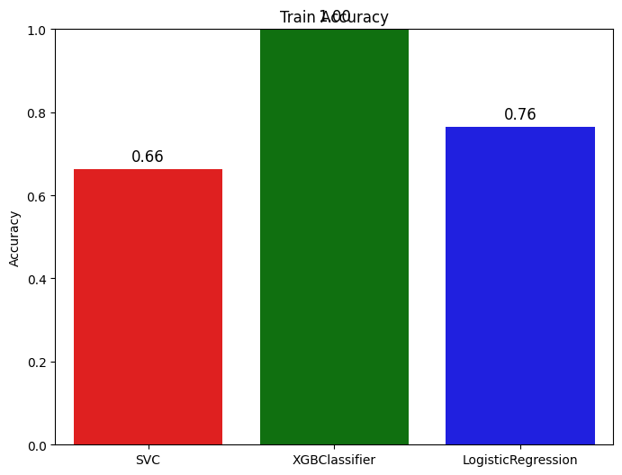
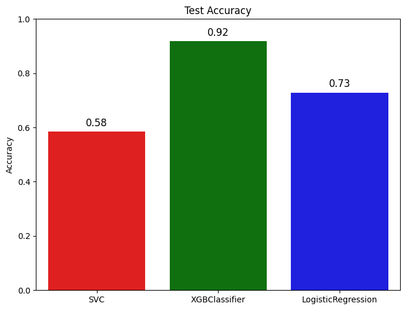
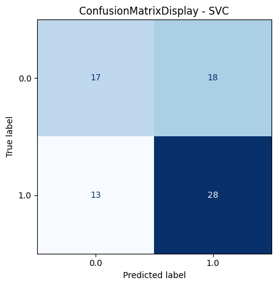
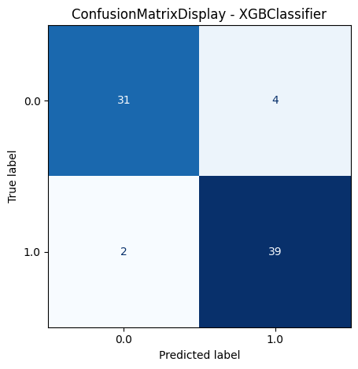
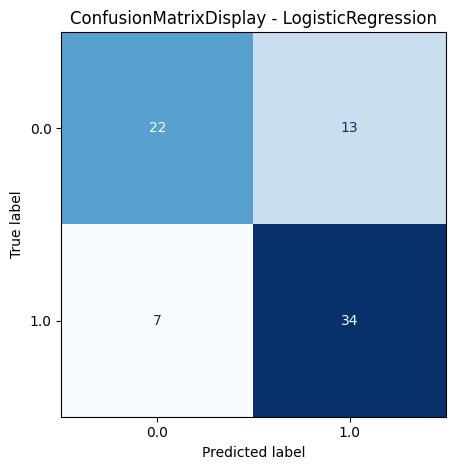

# Parkinson Disease Prediction (SVC, XGBClassifier, Logistic Regression)

This project builds and evaluates machine learning models to predict Parkinson's disease status using the provided `parkinson_disease.csv` dataset.

The workflow is implemented in `ParkinsonDiseasePrediction.ipynb` and includes:
- Data cleaning and feature pruning
- Feature selection with `SelectKBest(chi2)`
- Class imbalance handling with `RandomOverSampler`
- Training and evaluation of three models: `SVC`, `XGBClassifier`, and `LogisticRegression`
- Confusion matrix display and classification reports for each model

## Dataset

The notebook loads the dataset from:
`https://media.githubusercontent.com/media/fatahrahimi330/100-Machine-Learning-Projects/refs/heads/master/43-Parkinson%20Disease%20Prediction/parkinson_disease.csv`

Key fields used by the notebook:
- `class`: target label
- `id`: identifier column (removed after aggregation)

## Project Structure

```text
43-Parkinson Disease Prediction/
├── ParkinsonDiseasePrediction.ipynb
└── parkinson_disease.csv
└── README.md
```

## Methodology (Notebook Pipeline)

### 1. Data Preprocessing

1. Load the CSV into a pandas DataFrame.
2. Basic exploratory checks (shape, describe, info, missing values).
3. Data cleaning:
   - Group by `id` and take the mean.
   - Drop the `id` column.
4. Feature pruning:
   - Iteratively remove features that have correlation greater than `0.7` with another feature.

### 2. Feature Selection

1. Split into `X` (features) and `y` (target `class`).
2. Normalize features with `MinMaxScaler` (required for the chi-squared feature selection).
3. Select the top `k=30` features using:
   - `SelectKBest(chi2, k=30)`

### 3. Imbalance Handling

To address class imbalance:
- Apply `RandomOverSampler(sampling_strategy=1.0)` to make both classes equal in the resampled training set.

### 4. Train/Test Split

- Split into train and test sets with:
  - `test_size=0.2`
  - `random_state=42`

### 5. Models

The notebook trains and evaluates the following default models:
- `sklearn.svm.SVC`
- `xgboost.XGBClassifier`
- `sklearn.linear_model.LogisticRegression`

### 6. Evaluation

For each model, the notebook:
1. Predicts labels on `X_test`.
2. Computes a confusion matrix.
3. Displays the confusion matrix using `ConfusionMatrixDisplay`.
4. Prints `classification_report`.

Note on the “Accuracy” values printed in the notebook:
- The code uses `roc_auc_score` aliased as `ras`, but passes the predicted class labels (`y_pred`) rather than probabilities.
- As a result, the reported “Model Train Accuracy” / “Model Test Accuracy” values are actually **ROC-AUC on predicted labels**, not standard accuracy or ROC-AUC on probabilities.

## Example Results (from this run)

Test-set performance reported by the notebook:
- `SVC`: ~0.58 (printed as “Test Accuracy”, see note above)
- `XGBClassifier`: ~0.92
- `LogisticRegression`: ~0.73

Confusion matrices and `classification_report` are shown for all three models in the notebook under:
- `### 6. Evaluate the Models`








## Dependencies

To run the notebook, you need:
- `numpy`
- `pandas`
- `matplotlib`
- `seaborn`
- `scikit-learn`
- `imbalanced-learn`
- `xgboost`

Install (example):
```bash
pip install numpy pandas matplotlib seaborn scikit-learn imbalanced-learn xgboost
```

## How to Run

1. Ensure dependencies are installed.
2. Open and run `ParkinsonDiseasePrediction.ipynb` in Jupyter / Colab.

## Potential Improvements

- Compute ROC-AUC using predicted probabilities (`predict_proba`) or decision scores, instead of class labels.
- Use feature correlation pruning carefully (the current implementation mutates the columns list while iterating).
- Add hyperparameter tuning (e.g., grid search / randomized search) and cross-validation.
- Address the `LogisticRegression` convergence warning by increasing `max_iter` or adjusting scaling/solver.

