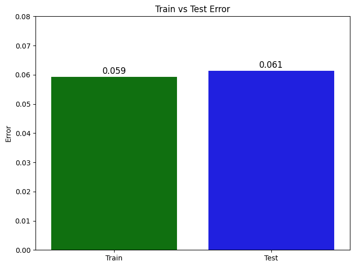
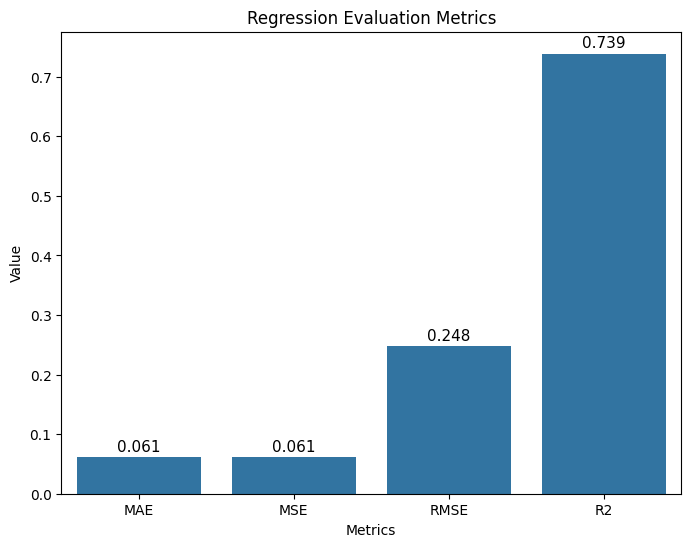

# Breast Cancer Wisconsin (Logistic Regression - scikit-learn)

This project implements a **Logistic Regression** model using **scikit-learn** to predict breast cancer diagnosis from the Breast Cancer Wisconsin features.

The repository contains:
- `BreastCancerWisconsin.ipynb` (end-to-end notebook)
- `data.csv` (dataset used by the notebook)

## Dataset

The dataset includes:
- `diagnosis` as the target label:  
  - `M` = Malignant  
  - `B` = Benign
- 30 numeric features describing the tumor measurements (mean / se / worst variants).

The notebook performs a small cleanup:
- Drops `id`
- Drops `Unnamed: 32` (empty column in the provided CSV)
- Encodes `diagnosis` as: `M -> 1`, `B -> 0`

### Dataset size (as loaded in the notebook)
- Rows: `569`
- Features after dropping label cleanup: `30`
- Train/Test split: `test_size=0.2` with `random_state=42`  
  - Train: `455` samples  
  - Test: `114` samples

## Methodology

1. **Load data**
   - The notebook reads `data.csv` from a GitHub raw URL.
   - The repo also includes `data.csv` locally for convenience.
2. **Preprocess**
   - Map labels: `{'M': 1, 'B': 0}`
   - Apply feature scaling using `MinMaxScaler`
3. **Train model**
   - Model: `sklearn.linear_model.LogisticRegression`
   - Hyperparameters used in the notebook:
     - `tol=0.01`
     - `max_iter=1000`
4. **Evaluate**
   - The notebook reports metrics computed between predicted labels and `y_test` using regression-style metrics:
     - MAE, MSE, RMSE, R²
   - Note: Because the target is binary (`0/1`), regression metrics may not match typical classification expectations.
   - The notebook also computes `MAPE`; it can become extremely large when `y_test` contains zeros (division by 0).

## Results

The notebook prints the following values:

- **Train Error (MAE on train predictions):** `0.059`
- **Test Error (MAE on test predictions):** `0.061`



Additional computed metrics on the test set:
- `MAE : 0.0614`
- `MSE : 0.0614`
- `RMSE : 0.2478`
- `R2   : 0.7386`
- `MAPE : 39505259889214.9297` (misleading here due to division by zero when true labels are `0`)




## How to Run

### Requirements
Install the Python dependencies used in the notebook:
```bash
pip install numpy pandas matplotlib seaborn scikit-learn
```
You’ll also need Jupyter to open the notebook:
```bash
pip install jupyter
```

### Run the notebook
From this folder:
```bash
jupyter notebook BreastCancerWisconsin.ipynb
```

## Notes / Recommendations

If you want more standard performance reporting for this classification problem, consider adding:
- `accuracy_score`
- `confusion_matrix`
- `classification_report`
- ROC-AUC (`roc_auc_score`)

## References

- Breast Cancer Wisconsin dataset (commonly referenced from UCI / scikit-learn examples)

