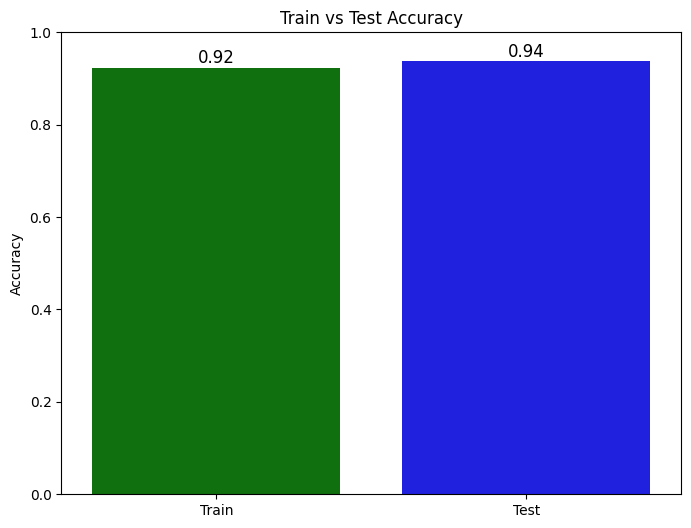
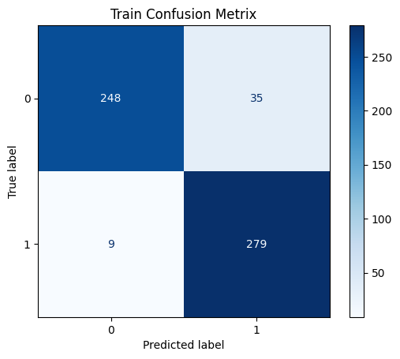
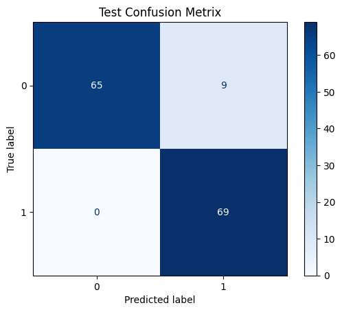

# Cancer Cell Classification (Gaussian Naive Bayes) — Scikit-Learn

This project implements a complete end-to-end (EDA → preprocessing → class balancing → training → evaluation) workflow for **binary cancer-cell classification** using **Scikit-Learn’s `GaussianNB`**.

The notebook trains a probabilistic Naive Bayes classifier on the **Breast Cancer Wisconsin** dataset provided by `sklearn.datasets.load_breast_cancer`.

## Project structure

- `CancerCellClassification.ipynb` — Jupyter notebook with the full workflow (data loading, EDA, `RandomOverSampler`, model training, and evaluation).

## Dataset

The notebook uses Scikit-Learn’s built-in breast cancer dataset:

- **Dataset loader**: `sklearn.datasets.load_breast_cancer`
- **Rows / columns (dataframe)**: `df.shape == (569, 31)`
  - 30 numeric feature columns
  - 1 target column named `target`
- **Missing values**: checked with `df.isnull().sum().sum()` and found to be **0**

## Preprocessing

### Feature/target split

- `X` is created from all columns except the last one
- `y` is created from the last column (`target`)

### Class balancing

To address class imbalance, the notebook applies:

- **Oversampler**: `imblearn.over_sampling.RandomOverSampler`
- **Random seed**: `random_state=42`
- **Operation**: `X, y = ros.fit_resample(X, y)`

> Note: in the current notebook, oversampling is performed **before** the train/test split for simplicity.

### Train/test split

- `train_test_split(X, y, test_size=0.2, random_state=42)`

## Model

- **Classifier**: `sklearn.naive_bayes.GaussianNB`
- Trained via `model.fit(X_train, y_train)`

## Evaluation

The notebook evaluates using:

- **Accuracy** (`sklearn.metrics.accuracy_score`)
- **Confusion matrix** (`sklearn.metrics.confusion_matrix` + `ConfusionMatrixDisplay`)

### Reported results

- **Train accuracy**: **0.923**
- **Test accuracy**: **0.937**






## How to run

Prerequisites:

- Python 3.x
- Jupyter (for viewing/running the notebook)

Install dependencies (example):

```bash
pip install numpy pandas matplotlib seaborn scikit-learn imbalanced-learn
```

Run the notebook:

```bash
jupyter notebook "CancerCellClassification.ipynb"
```

## Notes / possible improvements

- Use an `imblearn` pipeline so that `RandomOverSampler` is applied **only to the training fold** (avoids any bias from resampling before splitting).
- Add cross-validation and/or additional metrics (precision/recall/F1) for a more complete assessment.

## Acknowledgements

- Dataset: `load_breast_cancer` from Scikit-Learn (`sklearn.datasets`).

