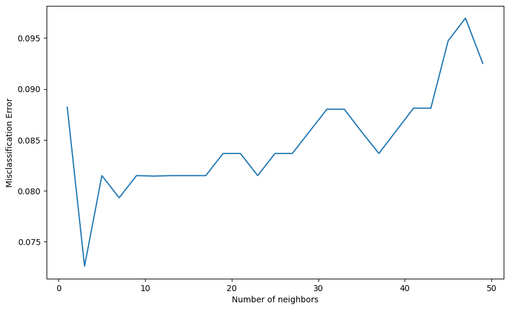
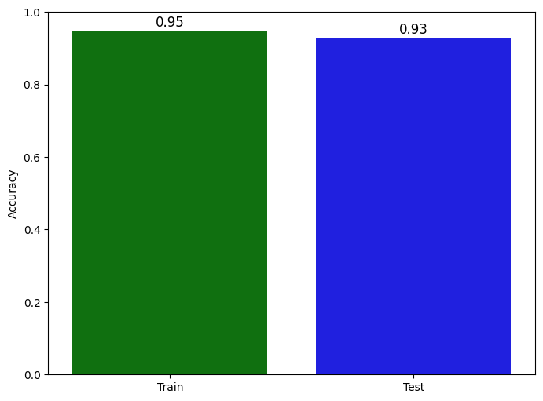
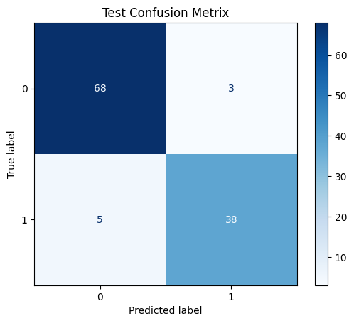

# Breast Cancer Wisconsin Diagnosis (KNN + Cross-Validation)

## Overview
This project builds a **k-Nearest Neighbors (KNN)** classifier for the **Breast Cancer Wisconsin** diagnosis task using **scikit-learn**. The notebook performs a **10-fold cross-validation** sweep over different odd values of `k` and selects the best model based on **misclassification error**.

## Dataset
- Source (downloaded via `kagglehub`): `uciml/breast-cancer-wisconsin-data`
- File used in the notebook: `data.csv`
- Target column: `diagnosis`
  - `M` = malignant
  - `B` = benign

## Workflow (as implemented in the notebook)
1. Import libraries: `numpy`, `pandas`, `matplotlib`, `seaborn`, `scikit-learn`
2. Load the dataset with `kagglehub.dataset_download(...)`
3. Exploratory visualizations (Seaborn scatter/`lmplot`)
4. Data cleaning
   - Check missing values with `df.isnull().sum()`
   - Drop the all-null column `Unnamed: 32`
5. Label encoding
   - Convert `diagnosis` from categorical to numeric:
     - `M` -> `1`
     - otherwise -> `0`
6. Create features/labels
   - `X = df.iloc[:, 1:]`
   - `y = df['diagnosis']`
7. Train/test split
   - `test_size=0.2`, `random_state=42`
8. KNN hyperparameter tuning (cross-validation)
   - Loop: `k in range(1, 51, 2)` (odd `k` values)
   - For each `k`, run `cross_val_score(..., cv=10, scoring='accuracy')`
   - Convert accuracy to misclassification error via `MSE = [1 - acc for acc in cv_scores]`
   - Select `optimal_k` using the minimum misclassification error
9. Final training + evaluation
   - Train `KNeighborsClassifier(n_neighbors=3)` on `X_train`
   - Report `model.score(...)` for train and test accuracy
   - Plot a confusion matrix for test predictions

## Results
- Optimal number of neighbors: `k = 3`
- Training accuracy: `0.95`
- Test accuracy: `0.93`






## Requirements
```bash
pip install numpy pandas matplotlib seaborn scikit-learn kagglehub jupyter
```

## How to Run
From this project directory:
```bash
jupyter notebook "BreastCancerWisconsinDiagnosis.ipynb"
```

The notebook downloads the dataset automatically at runtime using:
`kagglehub.dataset_download("uciml/breast-cancer-wisconsin-data")`.

## Notes / Caveats
- The notebook does **not** apply feature scaling before training KNN.
- The feature matrix is created with `X = df.iloc[:, 1:]`. If you want a stricter setup, ensure the target column (`diagnosis`) is not included in `X`.

