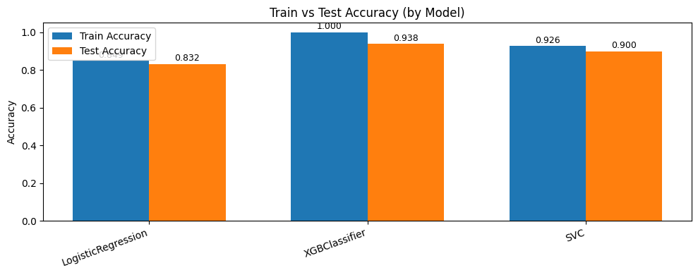
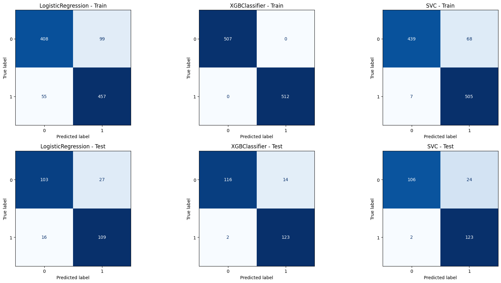

# Autism Prediction (SVC, LogisticRegression, XGBClassifier)

This project trains and compares three machine learning classifiers to predict autism spectrum disorder (ASD).
It uses the included `train.csv` dataset and evaluates models using ROC-AUC (train/test) plus confusion matrices.

## Dataset

`train.csv` contains 800 rows and 22 columns. The target column is:

- `Class/ASD` (0/1)

Key feature groups include:

- Symptom score features: `A1_Score` ... `A10_Score`
- Demographics / health attributes: `age`, `gender`, `ethnicity`, `jaundice`, `austim`, `used_app_before`, `contry_of_res`, `result`, `age_desc`, `relation`, etc.

The notebook also builds additional engineered features:

- `ageGroup` (derived from `age`)
- `sum_score` (sum of `A1_Score` ... `A10_Score`)
- `ind` (simple sum of `austim + used_app_before + jaundice`)

Dataset origin (also used by the notebook):
`https://media.githubusercontent.com/media/fatahrahimi330/100-Machine-Learning-Projects/refs/heads/master/47-Autism%20Prediction/train.csv`

## Requirements

Install the dependencies (versions not pinned):

```bash
pip install numpy pandas matplotlib seaborn scikit-learn xgboost imbalanced-learn
```

## Project Pipeline

The notebook (`AutismPrediction.ipynb`) follows these major steps:

1. **Load dataset** from `train.csv`
2. **Exploratory Data Analysis (EDA)**
3. **Preprocessing**
   - Replace `yes/no` with `1/0`
   - Replace missing/unknown category values (`?`, `others`) with `Others`
   - Filter rows with `result > -5`
   - **Feature engineering**
     - Create `ageGroup` from `age`
     - Apply log transform to `age`
     - Create `sum_score` (sum of `A1_Score` ... `A10_Score`)
     - Create `ind` = `austim + used_app_before + jaundice`
   - **Label encoding**: encode all `object`-dtype columns using `sklearn.preprocessing.LabelEncoder`
   - **Feature selection**: drop columns in `removal = ['ID', 'age_desc', 'used_app_before', 'austim']`
4. **Balance data**
   - Randomly over-sample the minority class with `RandomOverSampler(sampling_strategy="minority")`
5. **Train-test split**
   - `train_test_split(..., test_size=0.2, random_state=42)`
6. **Feature scaling**
   - `StandardScaler` fitted on train and applied to test
7. **Train models**
   - `LogisticRegression()`
   - `XGBClassifier()` (from `xgboost`)
   - `SVC(kernel="rbf")`
8. **Evaluate models**
   - Compute train/test ROC-AUC using the models' `predict` output
   - Plot a bar chart of **train vs test accuracy** (score) per model, with values shown on top of each bar
   - Render **confusion matrices** for both train and test using `ConfusionMatrixDisplay`

## Results (from the notebook outputs)

ROC-AUC scores observed in the notebook:

- LogisticRegression
  - Train: `0.8487`
  - Test: `0.8322`
- XGBClassifier
  - Train: `1.0000`
  - Test: `0.9382`
- SVC (RBF)
  - Train: `0.9261`
  - Test: `0.8997`

  
  


## How to Run

Open and run the notebook:

- `AutismPrediction.ipynb`

The notebook produces the preprocessing plots, the train/test score bar chart, and the confusion matrices in **Step 6: Evaluate the Models**.

## Files

- `AutismPrediction.ipynb`: Full training + evaluation workflow
- `train.csv`: Input dataset used by the notebook

## Notes

- The notebook computes ROC-AUC using `model.predict(...)` outputs rather than probability estimates (`predict_proba`).
- For production use, you may want to switch ROC-AUC to probability-based predictions and validate with cross-validation.

