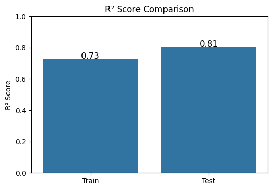
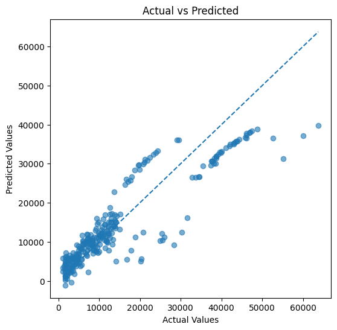

# Medical Insurance Price Prediction

This project involves predicting the cost of medical insurance using a Linear Regression model. Building upon exploratory data analysis and essential data preprocessing, this notebook estimates insurance charges based on individual attributes such as age, sex, BMI, number of children, smoking habits, and region.

## Table of Contents
- [Overview](#overview)
- [Dataset](#dataset)
- [Project Workflow](#project-workflow)
- [Installation and Dependencies](#installation-and-dependencies)
- [Usage](#usage)
- [Results](#results)

## Overview
The goal of this project is to build a machine learning model capable of predicting medical insurance charges. The core modeling is done using Scikit-Learn's `LinearRegression`, and the project includes extensive Exploratory Data Analysis (EDA) to find patterns and correlations within the dataset.

## Dataset
The dataset used in this project is `insurance.csv`, which contains information on various medical insurance beneficiaries. The features included are:
- `age`: Age of the primary beneficiary.
- `sex`: Gender of the insurance contractor (male, female).
- `bmi`: Body mass index, providing an understanding of body, weight relatively to height.
- `children`: Number of children covered by health insurance.
- `smoker`: Smoking status (yes, no).
- `region`: The beneficiary's residential area in the US (northeast, northwest, southeast, southwest).
- `charges`: Individual medical costs billed by health insurance (Target Variable).

## Project Workflow
1. **Data Loading:** The `insurance.csv` dataset is loaded using Pandas.
2. **Exploratory Data Analysis (EDA):**
   - Analyzing categorical feature distributions (`sex`, `smoker`, `region`) using pie charts and bar plots.
   - Determining relationships between continuous variables (`age`, `bmi`) and the target variable (`charges`) using scatter plots colored by smoking status.
   - Using box plots to detect outliers in the `age` and `bmi` columns.
3. **Data Preprocessing:**
   - Handling explicit outliers in the `bmi` feature using `ArbitraryOutlierCapper` from the `feature_engine` library.
   - Mapping categorical values into numerical formats for model ingestion.
   - Checking correlations between features and the target variable.
4. **Model Building & Training:** 
   - Splitting data into 80% training set and 20% test set.
   - Training a Multiple Linear Regression model using `sklearn.linear_model.LinearRegression`.
5. **Model Evaluation:**
   - Assessing the model's accuracy on the training and testing datasets using the $R^2$ Score.
   - Plotting Actual vs. Predicted values to visualize performance.





## Installation and Dependencies
To run this project locally, ensure you have Python installed. You can install the necessary dependencies using `pip`:

```bash
pip install numpy pandas matplotlib seaborn scikit-learn feature-engine
```

## Usage
1. Clone the repository holding this project or download the directory locally:
   ```bash
   git clone https://github.com/fatahrahimi330/100-Machine-Learning-Projects.git
   ```
2. Navigate to the project directory:
   ```bash
   cd "100-Machine-Learning-Projects/48-Medical Insurance Price Prediction"
   ```
3. Open the Jupyter Notebook:
   ```bash
   jupyter notebook MedicalInsurancePricePrediction.ipynb
   ```
4. Run all the cells in the notebook to view the EDA, train the Linear Regression model, and check the evaluations.

## Results
The trained Linear Regression model evaluates the relationship between inputs and medical charges. The notebook provides:
- **$R^2$ Score Comparison:** A bar chart comparing the Train and Test $R^2$ Scores.
- **Actual vs. Predicted Evaluation:** A scatter plot with an ideal line to demonstrate the accuracy of the predictions.
