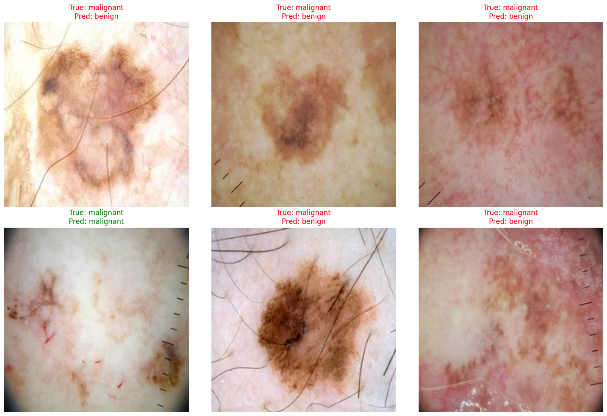
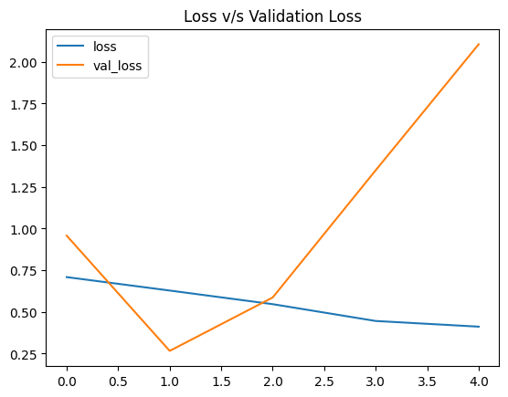
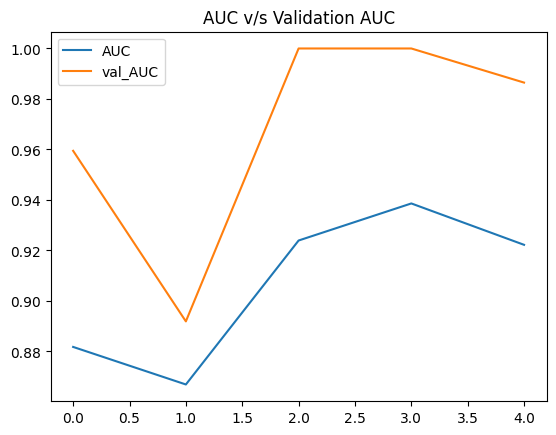

# Skin Cancer Detection using Transfer Learning

This repository contains a comprehensive Jupyter Notebook for **Skin Cancer Detection** using an advanced Transfer Learning technique in TensorFlow and Keras.

## Project Overview

Skin cancer is one of the most common types of cancer, and early detection plays a critical role in effective treatment. This project utilizes the power of transfer learning with the **EfficientNetB7** pre-trained architecture to classify skin lesions as either *benign* or *malignant*. 

By leveraging deep learning, this automated approach aims to facilitate faster and more reliable diagnosis of skin cancer from dermal images.

## Features

The notebook (`SkinCancerDetection.ipynb`) follows a well-structured pipeline:

1. **Importing Libraries**: Sets up the environment with essential libraries like TensorFlow, Pandas, NumPy, Maplotlib, and Seaborn.
2. **Loading Dataset**: Automatically downloads and extracts the [Skin Cancer Dataset](https://www.kaggle.com/datasets/shashanks1202/skin-cancer-dataset) directly from Kaggle.
3. **Data Preprocessing**:
   - Extracts labels from file paths.
   - Binarizes the output tags (`malignant` -> 1, `benign` -> 0).
   - Visualizes label distribution.
   - Splits the data into training (85%) and validation (15%) subsets.
   - Decodes, resizes (224x224), and normalizes images using `tf.data.Dataset` pipelines.
4. **Build the Model**: 
   - Uses `EfficientNetB7` (pre-trained on ImageNet) as the base feature extractor with its layers frozen.
   - Appends custom fully-connected layers consisting of Dense, BatchNormalization, and Dropout layers.
   - Final classification is performed via a Sigmoid activation layer.
5. **Compile and Fit the Model**:
   - The model is compiled using the stringently chosen `adam` optimizer and `BinaryCrossentropy`.
   - Trained over multiple epochs to evaluate Area Under Curve (AUC) tracking performance improvements.
6. **Make Prediction**: 
   - Uses the trained model on validation samples to visually predict classifying patches of skin lesions.
7. **Evaluate the Model**:
   - Validation performance is graphically evaluated by plotting training versus validation metrics (Loss and AUC).

## Dataset

The model is trained on the Kaggle [Skin Cancer Dataset](https://www.kaggle.com/datasets/shashanks1202/skin-cancer-dataset) uploaded by Shashank S. It encompasses two primary classifications:
- **Benign**: Non-cancerous skin moles or lesions.
- **Malignant**: Cancerous skin conditions.

## Usage

1. Clone this repository to your local machine:
   ```bash
   git clone <your-repository-url>
   ```
2. Navigate to the project directory:
   ```bash
   cd "49-Skin Cancer Detection"
   ```
3. Open the Jupyter Notebook:
   ```bash
   jupyter notebook SkinCancerDetection.ipynb
   ```
4. Run the code cells sequentially. Ensure that you have set up a Kaggle API token (`kaggle.json`) if running locally to download the dataset dynamically, or you can manually download and provide the dataset in the working directory.

## Requirements

Ensure you have the following packages installed:
- `Python 3.x`
- `tensorflow`
- `numpy`
- `pandas`
- `matplotlib`
- `seaborn`
- `scikit-learn`

You can install the dependencies via pip:
```bash
pip install tensorflow numpy pandas matplotlib seaborn scikit-learn jupyter
```

## Results

Transfer learning allows the model to produce high Area Under the Curve (AUC) accuracy without needing an excessive number of epochs, rendering the framework extremely robust and highly capable of accurate initial medical image evaluations.





## Contributing

Pull requests are always welcome! Feel free to open issues or contribute features.

## License

This project is licensed under the MIT License.
