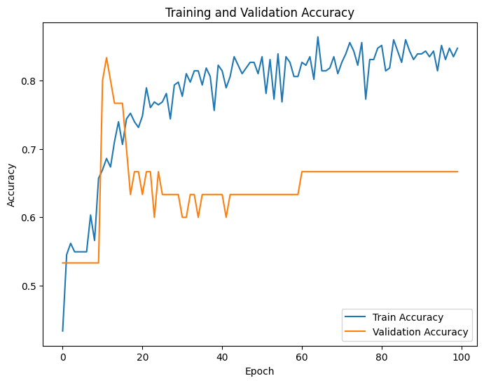
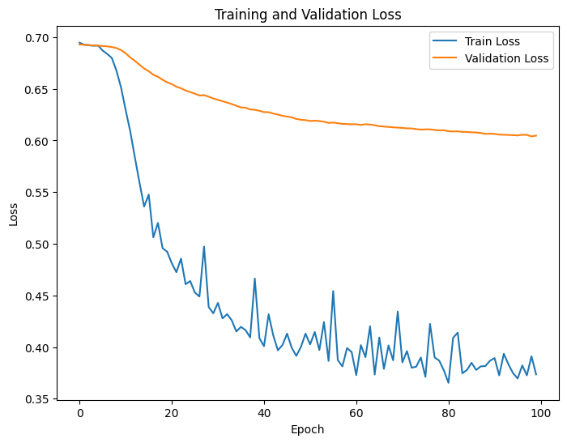
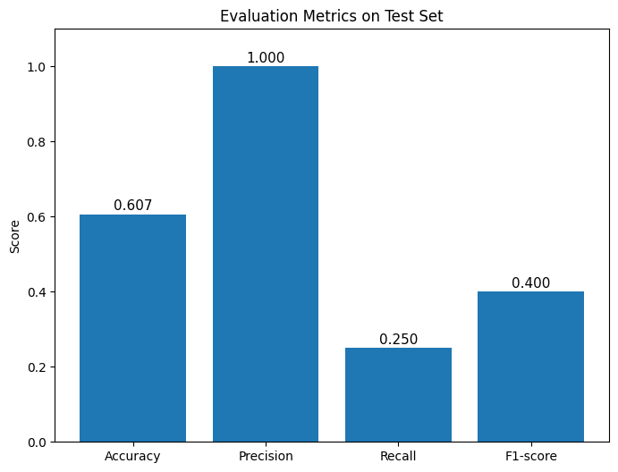
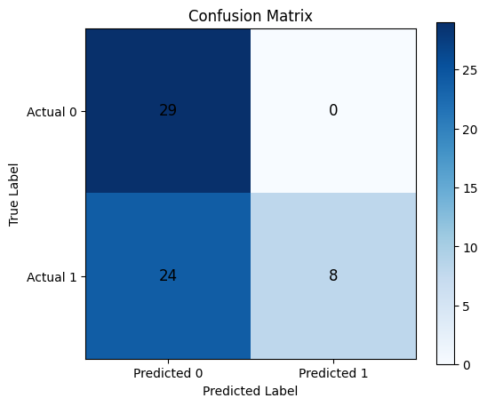
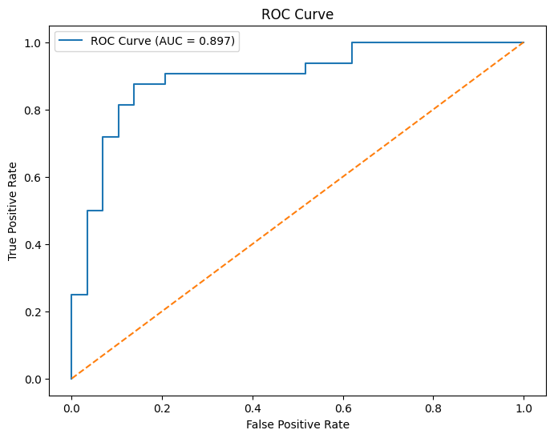

# Heart Disease Prediction using ANN

This project aims to predict the likelihood of heart disease in patients based on various medical attributes. The predictive model is built using an Artificial Neural Network (ANN) with TensorFlow and Keras.

## Project Structure
- `HeartDiseasePrediction.ipynb`: Jupyter Notebook containing the full workflow from data loading and preprocessing to model training and evaluation.
- `Dataset--Heart-Disease-Prediction-using-ANN.csv`: The dataset containing records of medical features and target diagnosis.

## Dataset
The dataset consists of 303 samples and 14 attributes:
- **age**: age in years
- **sex**: (1 = male; 0 = female)
- **cp**: chest pain type
- **trestbps**: resting blood pressure (in mm Hg on admission to the hospital)
- **chol**: serum cholestoral in mg/dl
- **fbs**: (fasting blood sugar > 120 mg/dl) (1 = true; 0 = false)
- **restecg**: resting electrocardiographic results
- **thalach**: maximum heart rate achieved
- **exang**: exercise induced angina (1 = yes; 0 = no)
- **oldpeak**: ST depression induced by exercise relative to rest
- **slope**: the slope of the peak exercise ST segment
- **ca**: number of major vessels (0-3) colored by flourosopy
- **thal**: 1 = normal; 2 = fixed defect; 3 = reversable defect
- **target**: 1 or 0 (Heart disease risk)

## Methodology
The project follows a standard machine learning pipeline:
1. **Importing Libraries**: Loading essential Python packages (`numpy`, `pandas`, `matplotlib`, `seaborn`, `tensorflow`, etc.)
2. **Data Loading**: Retrieving the dataset for exploratory analysis.
3. **Exploratory Data Analysis (EDA)**: Inspecting data distributions, checking for missing values, and summarizing statistics.
4. **Data Preprocessing**: Handling categorical variables and normalizing numerical features to prepare for neural network ingestion.
5. **Model Building**: Designing a Sequential ANN utilizing Dense layers with activation functions.
6. **Model Training**: Compiling the model with binary cross-entropy loss and training on the processed data.
7. **Model Evaluation**: Assessing model performance on unseen test data using Accuracy, Confusion Matrix, and a complete Classification Report.

## Getting Started

### Prerequisites
Ensure you have the following installed:
- Python 3.x
- Jupyter Notebook
- Pandas & NumPy
- Matplotlib & Seaborn
- Scikit-Learn
- TensorFlow

### Execution
Clone the repository, ensure your dependencies are installed, and simply run the cells inside the notebook:
```bash
jupyter notebook HeartDiseasePrediction.ipynb
```

## Results
The trained model produces detailed evaluation metrics such as model accuracy, precision, recall, and a visual heatmap of the Confusion Matrix to clearly outline its predictive capability.





