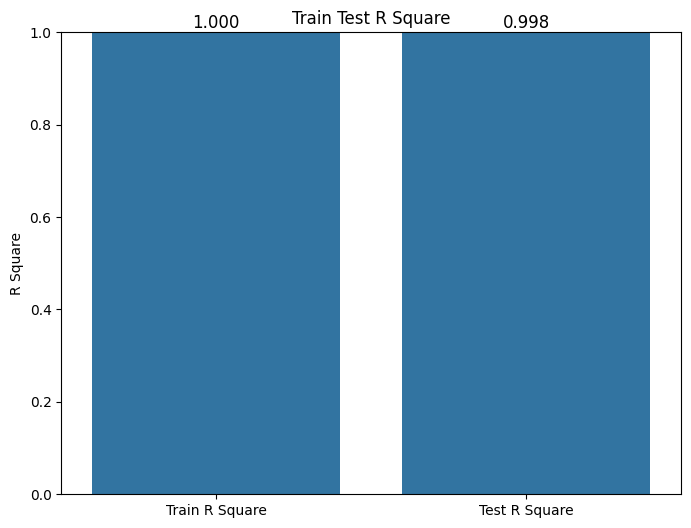
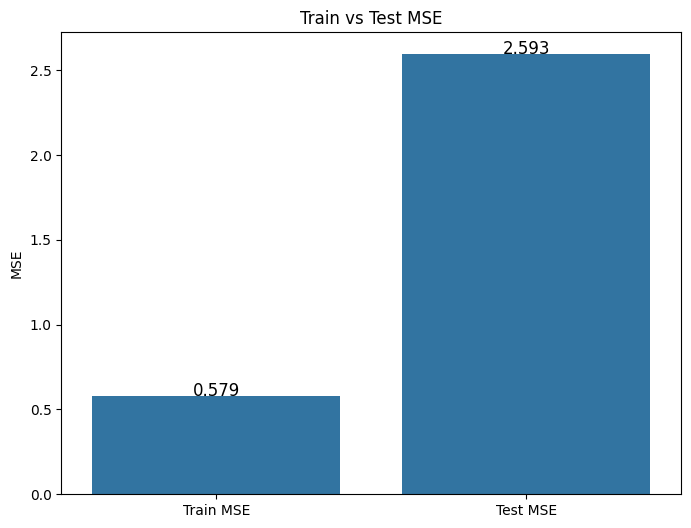
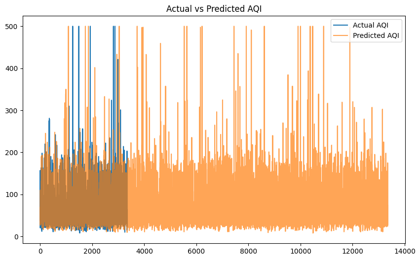

# 🌍 Predicting Air Quality Index 

## 📋 Project Overview
This project focuses on predicting the **PM2.5 Air Quality Index (AQI)** of various locations based on several environmental features and geographic coordinates. The machine learning model is built using the **RandomForestRegressor** algorithm from the Scikit-Learn library, delivering accurate and reliable predictions for air quality assessments.

## 🗂️ Dataset
The dataset utilized for this project is `AQI-and-Lat-Long-of-Countries.csv`. It includes various air pollutant indices and geographical location coordinates (latitude and longitude).
- **Features (`X`)**:
  - `CO AQI Value`: Carbon Monoxide Air Quality Index
  - `Ozone AQI Value`: Ozone Air Quality Index
  - `NO2 AQI Value`: Nitrogen Dioxide Air Quality Index
  - `lat`: Latitude of the location
  - `lng`: Longitude of the location
- **Target Variable (`y`)**: 
  - `PM2.5 AQI Value`: Fine Particulate Matter Air Quality Index (PM2.5)

## 🛠️ Technologies & Libraries Used
- **Python**
- **Data Manipulation**: `numpy`, `pandas`
- **Data Visualization**: `matplotlib.pyplot`, `seaborn`
- **Machine Learning**: `scikit-learn` (`RandomForestRegressor`, `train_test_split`, basic regression metrics)

## ⚙️ Methodology
1. **Data Loading & Preprocessing**: Load the dataset, check the dataframe structure, and inspect for any missing values.
2. **Exploratory Data Analysis (EDA)**: Evaluate feature distributions and linear correlations between different air pollutants and the target variable using visual plots like Correlation Heatmaps and scatter distributions.
3. **Data Splitting**: Separate predictors (`X`) from the target (`y`). The dataset is then split into training (80%) and testing (20%) subsets.
4. **Model Training**: A `RandomForestRegressor` with 100 estimators is fitted onto the training feature set to predict PM2.5 AQI values.
5. **Model Evaluation**: The model's predictions are compared against actual values from the test set utilizing standard regression metrics.
6. **Results Visualization**: Generated a scatter plot to visually inspect the relationship between Actual vs. Predicted PM2.5 AQI values.

## 📊 Model Evaluation Results
The Random Forest model yielded the following impressive results on the testing set:
- **Mean Absolute Error (MAE)**: `~8.17`
- **Mean Squared Error (MSE)**: `~246.69`
- **R-squared ($R^2$) Score**: `~0.866` (The model explains approximately 86.6% of the variance in the target variable)





## 🚀 How to Run the Project
1. Clone this repository or download the specific project directory.
2. Ensure you have Python installed, along with Jupyter Notebook and the necessary packages (`pip install numpy pandas matplotlib seaborn scikit-learn`).
3. Open the `PredictingAirQuality.ipynb` notebook.
4. Run all the cells sequentially to explore the data, train the RandomForest model, and view the evaluation metrics.

## 📁 Repository Structure
```text
51-Predicting Air Quality/
│
├── AQI-and-Lat-Long-of-Countries.csv    # The dataset used for analysis and training (Loadable via URL)
├── PredictingAirQuality.ipynb           # Main Jupyter Notebook containing the code
└── README.md                            # Project documentation (this file)
```
