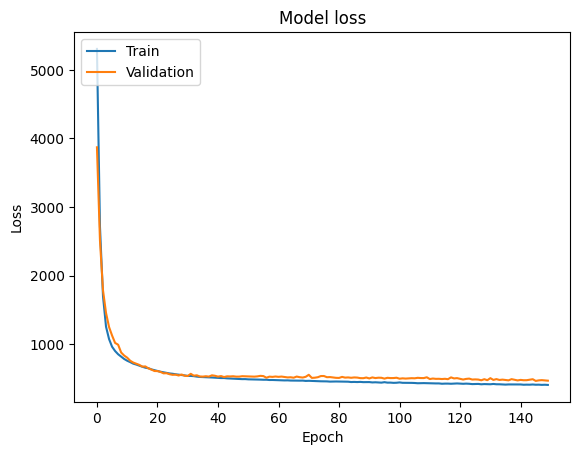

# Predicting Air Quality with Neural Networks (ANN)

This project is part of the **100+ Machine Learning Projects** series. It focuses on using Artificial Neural Networks (ANN) to predict the Air Quality Index (AQI) based on various pollutant features using a Sequential model built with TensorFlow and Keras.

## Project Overview
The objective of this project is to build a deep learning regression model that predicts the Air Quality Index (AQI) of cities using historical environmental data. The model is trained on various air pollutants to learn complex non-linear mappings between these features and the AQI target variable.

## Dataset
The dataset utilized is **`city_day.csv`** which contains daily air quality data and various atmospheric pollutant levels for different cities.
The features used for the prediction include:
- `PM2.5`, `PM10`
- `NO`, `NO2`, `NOx`, `NH3`
- `CO`, `SO2`, `O3`
- `Benzene`, `Toluene`, `Xylene`

*Target Variable:* `AQI`

## Technologies Used
- **Python** for overall programming
- **Pandas** and **NumPy** for data manipulation and mathematical operations
- **Matplotlib** and **Seaborn** for data visualization (Exploratory Data Analysis)
- **Scikit-Learn** for data preprocessing (Train-Test Split, Standard Scaling)
- **TensorFlow** & **Keras** for building and training the Artificial Neural Network

## Project Workflow
1. **Data Loading:** Ingesting the `city_day.csv` dataset.
2. **Exploratory Data Analysis (EDA):** Visualizing dataset characteristics, handling missing values, identifying distributions and feature correlations, and plotting AQI trends over time.
3. **Data Preprocessing:** 
   - Feature Selection and extraction of predictors ($X$) and target variable ($y$).
   - Splitting the dataset into Training (80%) and Test sets (20%).
   - Feature Scaling using `StandardScaler` to normalize the input data.
4. **Model Building:** Constructing a multi-layer deep neural network utilizing TensorFlow's Sequential API.
   - Dense Layers configuration: `64 -> 32 -> 16 -> 1`
   - Activation Function: `ReLU` for hidden layers.
5. **Model Training:** Compiling the model with the `adam` optimizer and tracking `mean_squared_error` for the loss function. Training the model across parameters for 150 epochs.
6. **Model Evaluation:** Observing training visually by plotting the learning curves (Training vs Validation loss) to ensure proper fitting.
7. **Prediction & Saving Strategy:** Passing mock predictions and saving the trained model as `model.h5` allowing re-usability and testing using `load_model`.

## Installation & Usage
1. Clone the repository and navigate to the project directory.
2. Ensure you have the required libraries installed. You can install them using:
   ```bash
   pip install numpy pandas matplotlib seaborn scikit-learn tensorflow
   ```
3. Open the Jupyter Notebook `predicting_air_quality.ipynb` to explore the code, visualization, and step-by-step training pipeline.
4. Execute the cells to retrain the model or see how historical data shapes the underlying deep learning prediction maps.

## Results
The trained neural network captures the variance effectively across features, and the test loss determines its regression accuracy. Training curves plot smoothly conveying solid convergence over 150 epochs with no evident overfitting due to effective data cleaning and architecture mapping.


