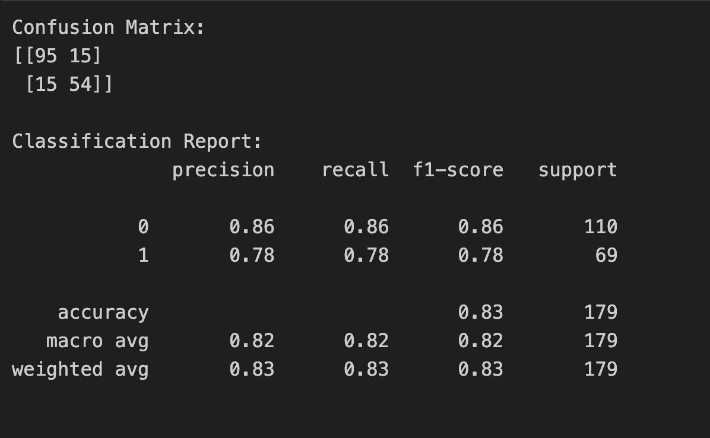
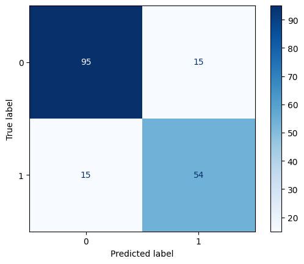

# Titanic Survival Prediction 🚢

This repository contains a machine learning project that predicts the survival of passengers on the Titanic using the famous classic Titanic dataset. The primary model utilized for the prediction is a **Random Forest Classifier** implemented via Scikit-Learn.

## 📌 Project Overview
The goal of this project is to build a predictive model that answers the question: *“what sorts of people were more likely to survive?”* using passenger data (i.e., name, age, gender, socio-economic class, etc.). 

The notebook seamlessly guides you from exploratory data analysis (EDA) to intensive data preprocessing, all the way to model training and evaluation.

## 📂 Repository Contents
- **`TitanicSurvivalPrediction.ipynb`**: The main Jupyter Notebook where the entire data pipeline, visualization, and modeling steps are executed.
- Data is directly fetched from remote endpoints during the execution process.

## 📊 Dataset
The dataset utilized is the **Titanic: Machine Learning from Disaster** dataset, divided into:
- `train.csv`: Data used to train our machine learning models.
- `test.csv`: Data used to evaluate the model and generate survival predictions.

## 🧠 Workbox and Pipeline
The process is rigorously split into structured sections inside the Jupyter Notebook:
1. **Importing Libraries**: Gathering the essential scientific libraries (`numpy`, `pandas`, `matplotlib`, `seaborn`).
2. **Loading Datasets**: Sourcing the datasets securely from remote servers.
3. **Exploratory Data Analysis (EDA)**: Identifying null values and visualizing survival rates across groups (like Sex).
4. **Processing missing values**: Replacing blanks using intelligent imputation, e.g., mapping unknown ages using the person's *Title*.
5. **Feature Engineering**: Creating distinct categorical `AgeGroup` bins, categorizing `FareBand`, extracting `Title` from names, and comprehensively encoding string values into numerically suitable formats.
6. **Modeling and Training**: Applying the **Random Forest Classifier** to an 80/20 train-test split cross-validation routine.
7. **Evaluate the Model**: Calculating accuracy, and outputting both the Confusion Matrix and a detailed Classification Report to understand the true/false positives and negatives.




8. **Prediction**: Feeding the unseen `test.csv` dataset iteratively into the trained model to infer exact final outcomes.

## ⚙️ How to Use
1. Clone the repository to your local machine:
```bash
git clone https://github.com/fatahrahimi330/100-Machine-Learning-Projects.git
```
2. Navigate to the directory:
```bash
cd "100-Machine-Learning-Projects/53-Titanic Survival Prediction"
```
3. Open the Jupyter Notebook:
```bash
jupyter notebook TitanicSurvivalPrediction.ipynb
```
4. Run the cells sequentially to observe data transformations, visualizations, and modeling results.

## 🛠️ Required Libraries
To run the notebook successfully, ensure the following Python packages are installed:
- `numpy`
- `pandas`
- `matplotlib`
- `seaborn`
- `scikit-learn`

---
*If you find this project helpful for learning predictive modeling, feel free to give the repository a ⭐!*
