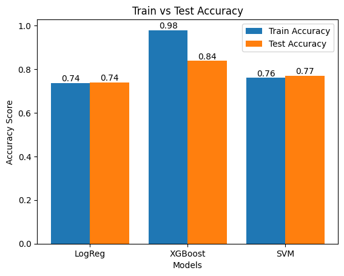
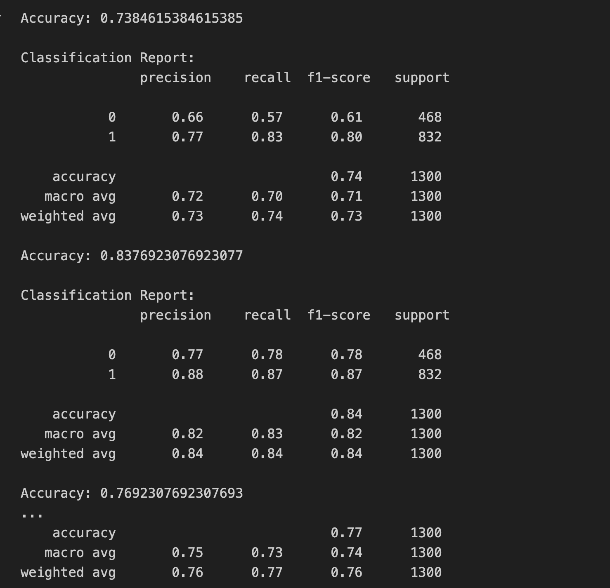
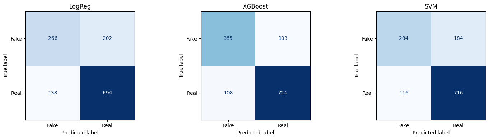

# Wine Quality Prediction 🍷

This project aims to predict the quality of wine based on its physicochemical characteristics. Using a dataset of thousands of wine samples, we build, train, and evaluate multiple machine learning classification models, including Logistic Regression, Support Vector Classifier (SVC), and XGBoost Classifier.

## 📁 Project Structure

*   `WineQualityPrediction.ipynb`: A Jupyter Notebook containing the entire data science workflow, from data loading to model evaluation.
*   `winequalityN.csv`: The dataset containing the physicochemical tests and quality ratings for numerous wine samples.

## 📊 Dataset Overview

The dataset (`winequalityN.csv`) contains 6,497 instances with 13 features:
*   `type`: Type of wine (red or white).
*   `fixed acidity`: Most acids involved with wine or fixed or nonvolatile (do not evaporate readily).
*   `volatile acidity`: The amount of acetic acid in wine.
*   `citric acid`: Found in small quantities, citric acid can add 'freshness' and flavor to wines.
*   `residual sugar`: The amount of sugar remaining after fermentation stops.
*   `chlorides`: The amount of salt in the wine.
*   `free sulfur dioxide`: The free form of SO2 exists in equilibrium between molecular SO2 (as a dissolved gas) and bisulfite ion.
*   `total sulfur dioxide`: Amount of free and bound forms of SO2.
*   `density`: The density of wine is close to that of water depending on the percent alcohol and sugar content.
*   `pH`: Describes how acidic or basic a wine is on a scale from 0 (very acidic) to 14 (very basic).
*   `sulphates`: A wine additive which can contribute to sulfur dioxide gas (SO2) levels.
*   `alcohol`: The percent alcohol content of the wine.
*   **Target Variable - `quality`**: Output variable (based on sensory data, score between 3 and 9).

## 🚀 Workflow

1.  **Importing Libraries**: Utilizing `pandas`, `numpy`, `matplotlib`, `seaborn`, and scaling/modeling modules from `scikit-learn` and `xgboost`.
2.  **Loading Dataset**: Loading the `winequalityN.csv` dataset into a pandas DataFrame.
3.  **Data Preprocessing**:
    *   **Exploratory Data Analysis (EDA)**: Understanding data distributions, checking summary statistics, and visualizing feature distributions using histograms and bar plots.
    *   **Handling Missing Values**: Imputing missing numerical values with their respective column means and handling categorical standardizations.
4.  **Feature Selection**: Dropping highly correlated or redundant features (e.g., `total sulfur dioxide`) to avoid multicollinearity.
5.  **Data Encoding & Splitting**: Preparing features (`X`) and target variable (`y`), followed by splitting into training and testing sets. Normalizing data using Scikit-Learn's standard scalers.
6.  **Model Training**:
    We implemented and trained the following classification algorithms:
    *   **Logistic Regression**
    *   **Support Vector Classifier (SVC)**
    *   **XGBClassifier (XGBoost)**
7.  **Model Evaluation**:
    *   Evaluating the models using accuracy scores and cross-validation techniques.
    *   Generating comprehensive classification reports detailing Precision, Recall, and F1-score for each model.





## 🛠️ Technologies & Libraries

*   **Python 3.x**
*   **Jupyter Notebook**
*   **Pandas & NumPy**: For Data Manipulation and Numerical Operations
*   **Matplotlib & Seaborn**: For Data Visualization
*   **Scikit-Learn**: For Model Building, Preprocessing, and Evaluation metrics
*   **XGBoost**: Gradient boosted decision tree library

## 🏃‍♂️ How to Run

1.  Clone this repository to your local machine.
2.  Ensure you have Python installed along with the required libraries (`pandas`, `numpy`, `matplotlib`, `seaborn`, `scikit-learn`, `xgboost`). You can install them using pip:
    ```bash
    pip install pandas numpy matplotlib seaborn scikit-learn xgboost
    ```
3.  Open `WineQualityPrediction.ipynb` in Jupyter Notebook or Jupyter Lab.
4.  Run the cells sequentially to observe data preprocessing, exploratory data analysis, and model training/evaluation.
