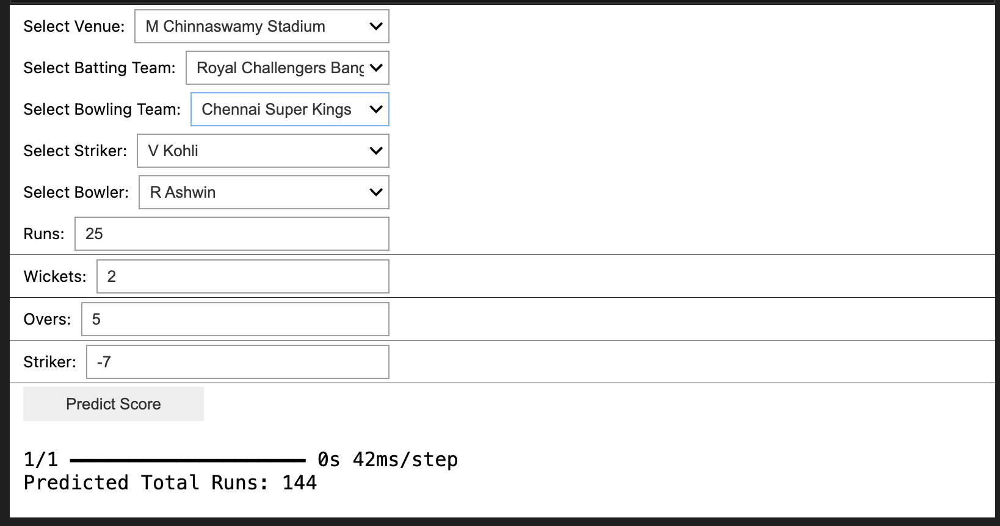
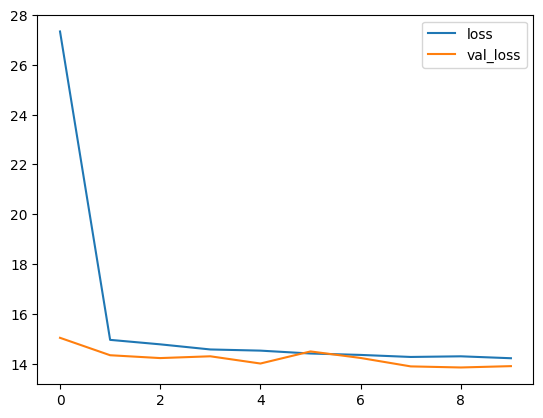
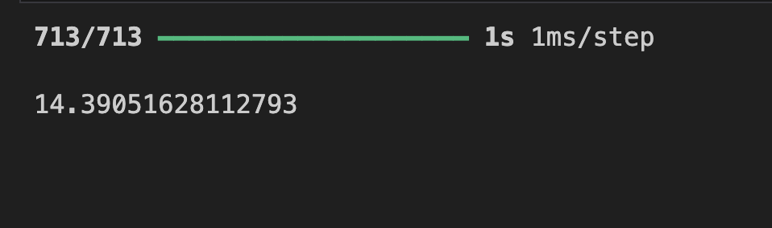

# IPL Score Prediction Using ANN in TensorFlow

## Overview
This project focuses on predicting the total score of an Indian Premier League (IPL) cricket team using an Artificial Neural Network (ANN) built with TensorFlow/Keras. It uses historical IPL match data to train the model, leveraging various features like runs, wickets, overs, and the specific teams and venues involved.

## Dataset
The dataset used in this project is `ipl_data.csv`, loaded from a remote GitHub repository.

**Features:**
- `mid`: Match ID
- `date`: Date of the match
- `venue`: Stadium where the match was played
- `bat_team`: Batting team
- `bowl_team`: Bowling team
- `batsman`: Name of the batsman facing the delivery
- `bowler`: Name of the bowler delivering the ball
- `runs`: Runs scored till that point
- `wickets`: Wickets fallen till that point
- `overs`: Overs bowled till that point
- `runs_last_5`: Runs scored in the last 5 overs
- `wickets_last_5`: Wickets fallen in the last 5 overs
- `striker`: Runs scored by the striker
- `non-striker`: Runs scored by the non-striker
- `total`: Total score of the batting team at the end of the innings (Target Variable)

## Data Preprocessing
1. **Exploratory Data Analysis (EDA):**
   - The dataset consists of 76,014 records and 15 columns.
   - Categorical features (venue, bat_team, bowl_team, batsman, bowler) were analyzed.
   - Unnecessary columns like 'mid', 'date', 'batsman', 'bowler', 'striker', 'non-striker' were dropped to simplify the model.

2. **Filtering Teams and Venues:**
   - The dataset was filtered to include only consistent playing teams (e.g., Chennai Super Kings, Mumbai Indians, etc.).
   - Only the most frequently used venues were kept to ensure enough data points for training.
   - The minimum required overs were set to 5.0 to have sufficient match context for prediction.

3. **Data Transformation:**
   - Categorical columns (`venue`, `bat_team`, `bowl_team`) were converted to numerical format using `LabelEncoder`.
   - The `total` column was separated as the target variable ($y$), and the rest were used as features ($X$).
   - The dataset was split into training (70%) and testing (30%) sets using `train_test_split`.
   - Feature scaling was applied using `MinMaxScaler` to normalize the input data.

## Model Building
An Artificial Neural Network (ANN) was constructed using TensorFlow's Keras API.

**Architecture:**
- **Input Layer:** Number of nodes equal to the number of features (43 nodes), with ReLU activation.
- **Hidden Layer 1:** 22 nodes, ReLU activation.
- **Hidden Layer 2:** 11 nodes, ReLU activation.
- **Output Layer:** 1 node (linear activation for regression).

**Compilation:**
- **Loss Function:** Huber loss (robust to outliers).
- **Optimizer:** Adam optimizer.

**Training:**
- The model was trained for 100 epochs, with validation on the test set.

## Evaluation
The model's performance was evaluated using various metrics and visualizations.

**Visualizations:**
- Training and validation loss curves over epochs.

**Metrics:**
- **Mean Absolute Error (MAE):** Provided the average magnitude of absolute errors in predictions.
- **Mean Squared Error (MSE):** Provided an idea of the squared error.
- **Root Mean Squared Error (RMSE):** Reflected the standard deviation of prediction errors.

## Model Testing and Inference
An `InteractiveWidget` created using `ipywidgets` is implemented in the notebook to interactively predict the total score. It allows the user to input match conditions (venue, batting team, bowling team, current runs, wickets, overs, runs in last 5 overs, wickets in last 5 overs) and outputs the predicted final score.

## Technologies Used
- **Python**
- **Libraries:**
  - `pandas` & `numpy` (Data Manipulation)
  - `matplotlib` & `seaborn` (Data Visualization)
  - `scikit-learn` (Data Preprocessing and Evaluation)
  - `tensorflow` (Model Building and Training)
  - `ipywidgets` (Interactive UI for inference)

## How to Run
1. Ensure you have Python installed.
2. Install the required libraries: `pip install pandas numpy matplotlib seaborn scikit-learn tensorflow ipywidgets`
3. Download or clone this repository.
4. Run the Jupyter Notebook `IPLScorePrediction.ipynb` to see the step-by-step implementation, visualizations, and interactive prediction widget.
