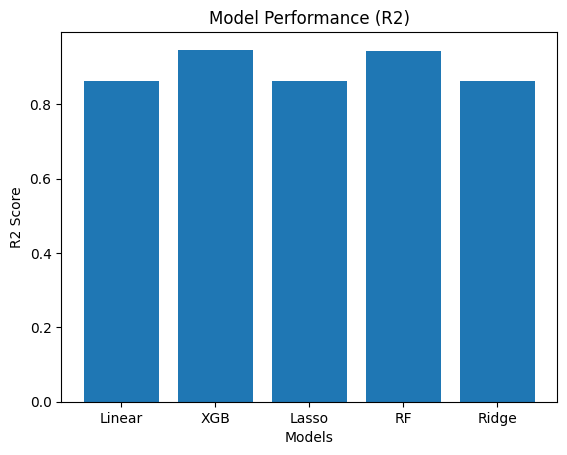
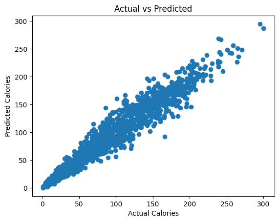
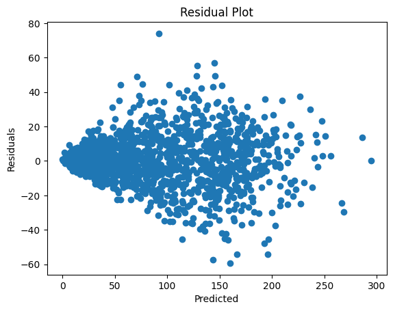

# 🔥 Calories Burnt Prediction using Multiple Algorithms in Scikit-Learn

Predict the number of calories burned during exercise using physiological and workout data, comparing five regression models implemented with Scikit-Learn and XGBoost.

---

## 📋 Table of Contents
- [Overview](#overview)
- [Dataset](#dataset)
- [Project Structure](#project-structure)
- [Workflow](#workflow)
- [Models & Results](#models--results)
- [Technologies Used](#technologies-used)
- [How to Run](#how-to-run)

---

## Overview

This project builds and evaluates multiple machine learning regression models to predict calories burnt during exercise sessions. It covers the full ML pipeline: data loading, preprocessing, model training, evaluation, and an interactive prediction widget.

---

## Dataset

The project uses two CSV files that are merged on `User_ID`:

| File | Description |
|---|---|
| `exercise.csv` | Contains physiological and exercise session features |
| `calories.csv` | Contains the calorie burn target values |

**Merged Dataset Shape:** 15,000 rows × 9 columns

### Features

| Feature | Type | Description |
|---|---|---|
| `Gender` | Categorical | Male (0) / Female (1) |
| `Age` | Integer | Age in years (20–79) |
| `Height` | Float | Height in cm (123–222) |
| `Weight` | Float | Weight in kg (36–132) |
| `Duration` | Float | Exercise duration in minutes (1–30) |
| `Heart_Rate` | Float | Heart rate in bpm (67–128) |
| `Body_Temp` | Float | Body temperature in °C (37.1–41.5) |
| **`Calories`** | Float | **Target — calories burned (1–314)** |

> **Note:** `Weight` and `Duration` were removed during preprocessing due to high correlation (>0.9) with other features.

---

## Project Structure

```
56-Calories Burnt Prediction/
├── CaloriesBurntPrediction.ipynb   # Main Jupyter Notebook
├── exercise.csv                    # Exercise session data
├── calories.csv                    # Calorie burn data
└── README.md                       # Project documentation
```

---

## Workflow

1. **Import Libraries** — NumPy, Pandas, Matplotlib, Seaborn, Scikit-Learn, XGBoost, ipywidgets
2. **Load Dataset** — Read both CSVs from GitHub and merge on `User_ID`
3. **Data Preprocessing**
   - Inspect shape, statistics, and data types
   - Check for missing values (none found)
   - Encode `Gender` (male → 0, female → 1)
   - Remove highly correlated features (`Weight`, `Duration`) via heatmap analysis
   - Split into train/test sets (90% / 10%, `random_state=22`)
   - Scale features with `StandardScaler`
4. **Build & Fit Models** — Train five regression models and evaluate MAE on train and validation sets
5. **Make Predictions** — Interactive widget for real-time single-sample prediction
6. **Evaluate Models** — Compare MAE, RMSE, and R² scores with bar chart visualizations

---

## Models & Results

| Model | MAE | RMSE | R² |
|---|---|---|---|
| Linear Regression | 18.01 | 22.82 | 0.863 |
| **XGBRegressor** | **10.12** | **14.29** | **0.946** |
| Lasso | 17.99 | 22.84 | 0.863 |
| Random Forest | 10.44 | 14.78 | 0.943 |
| Ridge | 18.01 | 22.82 | 0.863 |





🏆 **Best Model: XGBRegressor** — Achieved the highest R² score (0.946) and the lowest MAE (10.12).

---

## Technologies Used

| Library | Purpose |
|---|---|
| `numpy` | Numerical computations |
| `pandas` | Data manipulation and merging |
| `matplotlib` / `seaborn` | Data visualization |
| `scikit-learn` | Preprocessing, model training, and evaluation |
| `xgboost` | Gradient boosting regressor |
| `ipywidgets` | Interactive prediction UI |

---

## How to Run

1. **Clone the repository:**
   ```bash
   git clone https://github.com/fatahrahimi330/100-Machine-Learning-Projects.git
   cd "100-Machine-Learning-Projects/56-Calories Burnt Prediction"
   ```

2. **Install required libraries:**
   ```bash
   pip install numpy pandas matplotlib seaborn scikit-learn xgboost ipywidgets
   ```

3. **Launch the notebook:**
   ```bash
   jupyter notebook CaloriesBurntPrediction.ipynb
   ```

4. **Run all cells** — The datasets are loaded directly from GitHub, so no local file paths need to be configured.

5. **Use the interactive widget** in Section 5 to input physiological values and predict calories burned using any of the five trained models.

---

> Part of the [100+ Machine Learning Projects](https://github.com/fatahrahimi330/100-Machine-Learning-Projects) collection.
