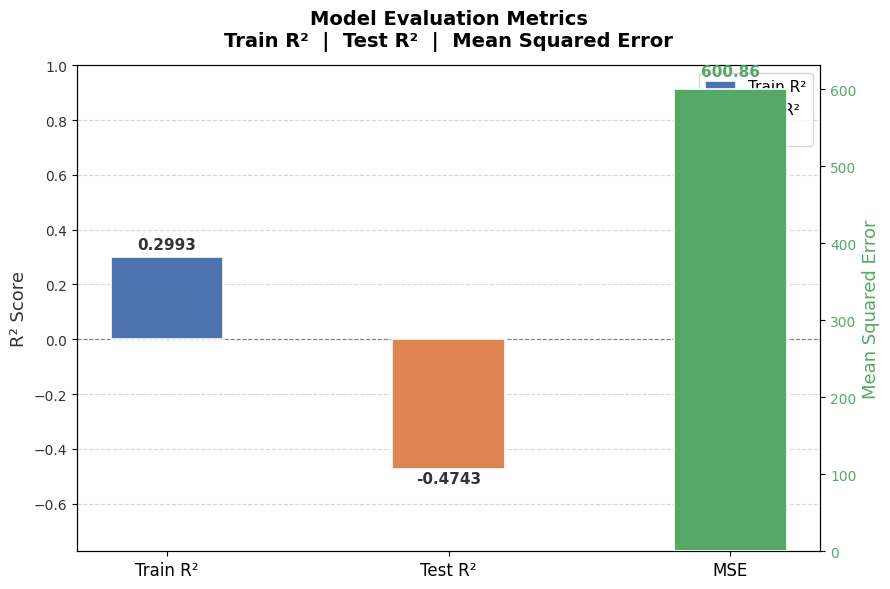

# 🚗 Vehicle Count Prediction

A machine learning project that predicts hourly vehicle traffic counts using **time-series feature engineering** and a **Random Forest Regressor** built with scikit-learn.

---

## 📌 Project Overview

Traffic volume forecasting is critical for urban planning, smart city development, and road infrastructure management. This project trains a regression model on historical hourly vehicle count data to predict future traffic levels based purely on **temporal features** extracted from the datetime column.

---

## 📂 Project Structure

```
57-Vehicle Count Prediction/
├── vehicle_count_prediction.ipynb   # Main Jupyter Notebook
├── vehicles.csv                     # Dataset (48,120 hourly records)
└── README.md                        # Project documentation
```

---

## 📊 Dataset

| Property       | Details                                  |
|----------------|------------------------------------------|
| **File**       | `vehicles.csv`                           |
| **Source**     | [GitHub Repository (raw CSV)](https://media.githubusercontent.com/media/fatahrahimi330/100-Machine-Learning-Projects/refs/heads/master/57-Vehicle%20Count%20Prediction/vehicles.csv) |
| **Records**    | 48,120 hourly observations               |
| **Time Range** | Starting from November 1, 2015           |
| **Columns**    | `DateTime`, `Vehicles`                   |

### Statistical Summary

| Statistic | Vehicles |
|-----------|----------|
| Count     | 48,120   |
| Mean      | ≈ 22.79  |
| Std Dev   | ≈ 20.75  |
| Min       | 1        |
| 25th %ile | 9        |
| Median    | 15       |
| 75th %ile | 29       |
| Max       | 180      |

---

## 🔧 Workflow

### 1. Import Libraries
```python
import numpy as np
import matplotlib.pyplot as plt
import pandas as pd
import seaborn as sns
```

### 2. Load Dataset
The dataset is loaded directly from the GitHub repository URL into a Pandas DataFrame.

### 3. Data Preprocessing

The `DateTime` column is parsed and broken down into the following **temporal features**:

| Feature       | Description                       |
|---------------|-----------------------------------|
| `day`         | Day of the month (1–31)           |
| `weekday`     | Day of the week (0=Mon, 6=Sun)    |
| `hour`        | Hour of the day (0–23)            |
| `month`       | Month of the year (1–12)          |
| `year`        | Calendar year                     |
| `dayofyear`   | Day of the year (1–366)           |
| `weekofyear`  | ISO week number of the year       |

The original `DateTime` column is dropped after feature extraction. No missing values were found in the dataset.

### 4. Build & Train the Model

- **Algorithm:** `RandomForestRegressor` (scikit-learn)
- **Train/Test Split:** 80% training / 20% testing (`random_state=42`)

```python
from sklearn.ensemble import RandomForestRegressor
model = RandomForestRegressor()
model.fit(X_train, y_train)
```

### 5. Make Predictions

```python
y_pred = model.predict(X_test)
```

**Sample Predictions:**

| Actual | Predicted |
|--------|-----------|
| 9      | 22.87     |
| 97     | 31.73     |
| 13     | 24.40     |
| 11     | 9.18      |
| 24     | 18.48     |

### 6. Evaluate the Model

| Metric              | Value       |
|---------------------|-------------|
| **Train R²**        | 0.2993      |
| **Test R²**         | -0.4743     |
| **Mean Squared Error (Test)** | 600.86 |



> **Note:** The negative Test R² indicates that the model — trained only on temporal features such as hour-of-day, weekday, and month — struggles to generalize to unseen data. The strong cyclical and seasonal patterns in traffic data are partially captured, but additional features (e.g., weather, special events, junction information) would likely improve prediction performance significantly.

### 7. Plot Evaluation Metrics

A dual-axis bar chart is generated to visualize the Train R², Test R², and MSE side by side for a clear comparison.

---

## 🛠️ Technologies Used

| Library        | Purpose                              |
|----------------|--------------------------------------|
| `pandas`       | Data loading and feature engineering |
| `numpy`        | Numerical operations                 |
| `matplotlib`   | Plotting evaluation metrics          |
| `seaborn`      | Data visualization                   |
| `scikit-learn` | Model training and evaluation        |

---

## 🚀 How to Run

### Prerequisites

```bash
pip install numpy pandas matplotlib seaborn scikit-learn
```

### Steps

1. **Clone the repository:**
   ```bash
   git clone https://github.com/fatahrahimi330/100-Machine-Learning-Projects.git
   cd "100-Machine-Learning-Projects/57-Vehicle Count Prediction"
   ```

2. **Launch Jupyter Notebook:**
   ```bash
   jupyter notebook vehicle_count_prediction.ipynb
   ```

3. **Run all cells** to reproduce the results end-to-end.

---

## 📈 Results

The Random Forest Regressor demonstrates moderate learning capacity on the training set (Train R² ≈ 0.30), but exhibits limited generalization on the test set (Test R² ≈ -0.47). This is a common outcome when working with time-series traffic data using only calendar-based features, and highlights potential areas for improvement such as:

- Incorporating **external data** (weather, events, holidays)
- **Lag features** and rolling window statistics
- Experimenting with sequence-aware models (e.g., LSTM, Prophet)

---

## 🤝 Contributing

Contributions and improvements are welcome! Feel free to open an issue or submit a pull request.

---

## 📄 License

This project is part of the [100+ Machine Learning Projects](https://github.com/fatahrahimi330/100-Machine-Learning-Projects) collection and is intended for educational purposes.
