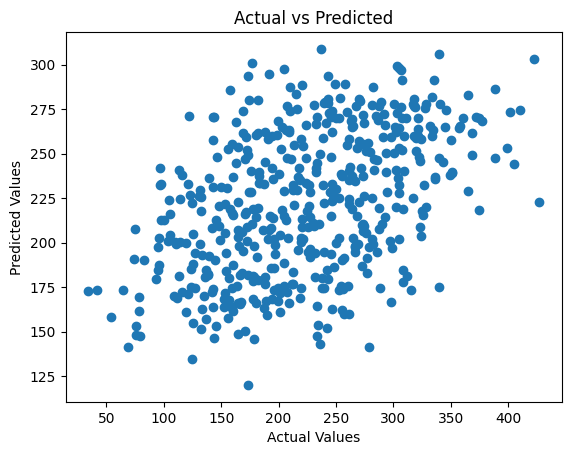
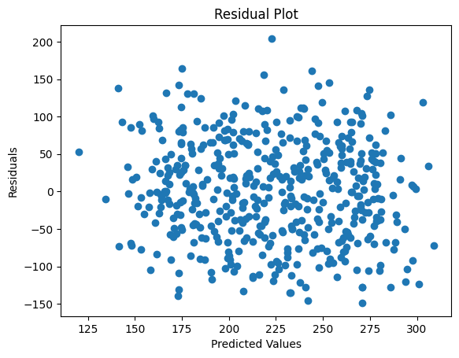
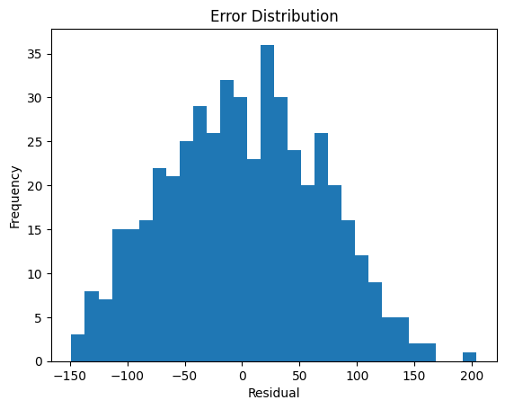
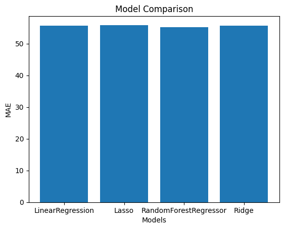

# 🏍️ Ola Bike Ride Request Forecast

A machine learning project that predicts the hourly count of Ola bike ride requests using regression models including **Linear Regression**, **Lasso**, **Ridge**, and **Random Forest Regressor** from Scikit-Learn.

---

## 📋 Table of Contents

- [Project Overview](#project-overview)
- [Dataset](#dataset)
- [Dataset Columns](#dataset-columns)
- [Project Workflow](#project-workflow)
- [Models Used](#models-used)
- [Model Performance](#model-performance)
- [Best Model](#best-model)
- [Evaluation Metrics](#evaluation-metrics)
- [Visualizations](#visualizations)
- [Technologies Used](#technologies-used)
- [How to Run](#how-to-run)

---

## 📌 Project Overview

This project aims to forecast the number of bike ride requests on the Ola platform at a given date and time. It applies multiple regression algorithms and selects the best-performing model based on the **Mean Absolute Error (MAE)** on the validation set.

---

## 📦 Dataset

The dataset is loaded directly from the GitHub repository:

```
https://media.githubusercontent.com/media/fatahrahimi330/100-Machine-Learning-Projects/refs/heads/master/58-Ola%20Bike%20Ride%20Request%20Forecast/ola.csv
```

- **Total records:** 10,886 entries
- **Total features:** 9 columns
- **Time range:** 2011-01-01 to 2012-03-29 (hourly data)

---

## 📊 Dataset Columns

| Column       | Description                                           |
|-------------|-------------------------------------------------------|
| `datetime`  | Timestamp of the ride request (hourly)                |
| `season`    | Season category (1=Spring, 2=Summer, 3=Fall, 4=Winter)|
| `weather`   | Weather condition (1–4 scale)                         |
| `temp`      | Temperature in Celsius                                |
| `humidity`  | Humidity level                                        |
| `windspeed` | Wind speed                                            |
| `casual`    | Count of casual (non-registered) users                |
| `registered`| Count of registered users                             |
| `count`     | Total count of bike ride requests (target variable)   |

---

## 🔄 Project Workflow

### 1. Importing Libraries

```python
import numpy as np
import pandas as pd
import matplotlib.pyplot as plt
import seaborn as sns
from sklearn.model_selection import train_test_split
from sklearn.preprocessing import StandardScaler
from sklearn.linear_model import LinearRegression, Lasso, Ridge
from sklearn.ensemble import RandomForestRegressor
from sklearn.metrics import mean_absolute_error, mean_squared_error, r2_score
```

### 2. Loading the Dataset

The dataset is loaded from a public GitHub URL using `pd.read_csv()`.

### 3. Data Preprocessing

- **Missing Values:** `temp`, `humidity`, and `windspeed` have **1,632 missing entries** each; other columns have no missing values.
- **Feature Engineering from Datetime:**
  - `year`, `month`, `day`, `time` (hour)
  - `weekday` – whether the day is a weekday or weekend (binary)
  - `am_or_pm` – AM (0) or PM (1) based on the hour
  - `holidays` – whether the date is a public holiday in India (using the `holidays` library)
- **Dropped Columns:** `datetime` and `date` columns (raw string versions) are dropped after extraction.
- **Cyclical Feature Encoding:**
  - Sine/cosine transformations for `hour`, `weekday`, and `month` to capture periodicity:
    - `hour_sin`, `hour_cos`
    - `weekday_sin`, `weekday_cos`
    - `month_sin`, `month_cos`
- **Target Variable:** `count` (total ride requests)
- **Train/Test Split:** 90% training, 10% testing (`random_state=22`)
  - Training set: **4,315 samples**, 12 features
  - Test set: **480 samples**, 12 features
- **Feature Scaling:** `StandardScaler` applied to normalize features.

### 4. Building and Fitting the Models

Four regression models are trained on the training set and evaluated on the test set using **Mean Absolute Error (MAE)**:

| Model                  | Training MAE | Validation MAE |
|------------------------|-------------|----------------|
| LinearRegression       | 55.52        | 55.75          |
| Lasso                  | 55.54        | 55.87          |
| RandomForestRegressor  | **20.58**    | **54.99**      |
| Ridge                  | 55.52        | 55.75          |

### 5. Making Predictions

A helper function `prepare_input(datetime_string)` builds a feature vector from a given datetime string:

```python
new_data = prepare_input('2026-03-27 14:30:00')
prediction = best_model.predict(new_data)
print("Prediction:", prediction[0])
# Output: 280.06
```

### 6. Model Evaluation

The best model (`RandomForestRegressor`) is evaluated on the test set:

```
📊 Model Evaluation Metrics:
MAE  : 55.28
MSE  : 4501.36
RMSE : 67.09
R²   : 0.206
```

---

## 🤖 Models Used

- **Linear Regression** – Baseline linear model
- **Lasso Regression** – Linear model with L1 regularization
- **Ridge Regression** – Linear model with L2 regularization
- **Random Forest Regressor** – Ensemble model using multiple decision trees

---

## 🏆 Best Model

The **RandomForestRegressor** achieved the lowest **Validation MAE of 54.99** and was selected as the best-performing model.

---

## 📐 Evaluation Metrics

The best model is assessed using the following metrics on the test set:

| Metric | Value    |
|--------|----------|
| MAE    | 55.28    |
| MSE    | 4501.36  |
| RMSE   | 67.09    |
| R²     | 0.206    |

---

## 📈 Visualizations

The project includes the following plots:

1. **Ride Count Patterns** – Average ride count by `day`, `time` (hour), and `month`
2. **Actual vs. Predicted** – Scatter plot comparing true and predicted values
3. **Residual Plot** – Scatter plot of residuals vs. predicted values
4. **Error Distribution** – Histogram of residuals with 30 bins






---

## 🛠️ Technologies Used

| Library      | Purpose                              |
|-------------|--------------------------------------|
| Python       | Programming language                |
| Pandas       | Data manipulation                   |
| NumPy        | Numerical computations              |
| Matplotlib   | Data visualization                  |
| Seaborn      | Statistical data visualization      |
| Scikit-Learn | Machine learning models & utilities |
| holidays     | Indian public holiday detection     |

---

## ▶️ How to Run

1. **Clone the repository:**

```bash
git clone https://github.com/fatahrahimi330/100-Machine-Learning-Projects.git
cd "100-Machine-Learning-Projects/58-Ola Bike Ride Request Forecast"
```

2. **Install the required libraries:**

```bash
pip install numpy pandas matplotlib seaborn scikit-learn holidays
```

3. **Open the notebook:**

```bash
jupyter notebook OlaBikeRideRequestForecast.ipynb
```

4. **Run all cells** in order to reproduce the full analysis and results.

---

## 📁 Project Structure

```
58-Ola Bike Ride Request Forecast/
├── OlaBikeRideRequestForecast.ipynb   # Main Jupyter Notebook
├── ola.csv                            # Dataset
└── README.md                          # Project documentation
```

---

> **Note:** This project is part of the [100+ Machine Learning Projects](https://github.com/fatahrahimi330/100-Machine-Learning-Projects) collection.
