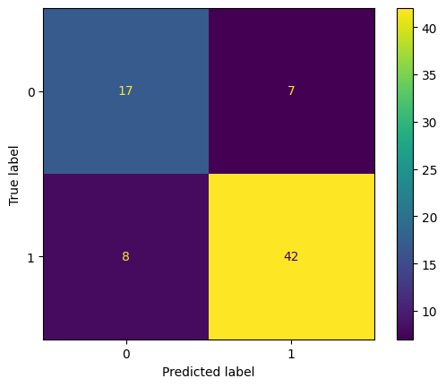
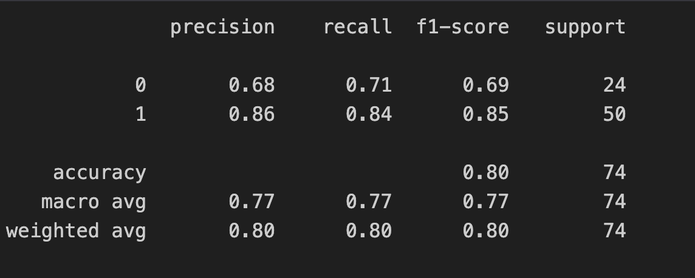

# Rainfall Prediction ⛈️

This project implements a machine learning solution to predict rainfall based on various meteorological parameters. Using a dataset consisting of several atmospheric measurements, we've developed a classification model that determines whether it will rain on a given day.

## 📊 Dataset Overview

The dataset (`Rainfall.csv`) contains daily weather observations including:
- **Pressure**: Atmospheric pressure.
- **Temperature**: Maximum, minimum, and average temperatures.
- **Dewpoint**: Atmospheric moisture content.
- **Humidity**: Relative humidity percentage.
- **Cloud Cover**: Percentage of the sky covered by clouds.
- **Sunshine**: Duration of sunshine in hours.
- **Wind**: Speed and direction.
- **Rainfall (Target)**: Categorical value ('yes' or 'no').

## 🛠️ Tech Stack

- **Python**: Core programming language.
- **Pandas & NumPy**: Data manipulation and analysis.
- **Matplotlib & Seaborn**: Data visualization.
- **Scikit-Learn**: Machine learning modeling.
- **XGBoost**: Advanced gradient boosting algorithm.
- **Imbalanced-learn**: Handling class imbalance with `RandomOverSampler`.

## ⚙️ Workflow

1. **Data Cleaning**: Stripped whitespace from column names and handled missing values.
2. **Exploratory Data Analysis (EDA)**: Analyzed feature distributions and correlations to understand weather patterns leading to rain.
3. **Pre-processing**:
   - Encoded the categorical target variable.
   - Handled class imbalance using **RandomOverSampler** to ensure the model doesn't favor the majority class.
   - Performed feature scaling using **StandardScaler**.
4. **Model Development**: Trained multiple classifiers:
   - Logistic Regression
   - Support Vector Classifier (SVC)
   - XGBoost Classifier
5. **Evaluation**: Assessed models using Accuracy Score, Confusion Matrix, and Classification Reports (Precision, Recall, F1-Score).

## 🚀 Getting Started

### Prerequisites
Ensure you have the following libraries installed:
```bash
pip install pandas numpy matplotlib seaborn scikit-learn xgboost imbalanced-learn
```

### Running the Project
1. Clone the repository.
2. Navigate to the project directory.
3. Open `RainfallPrediction.ipynb` in Jupyter Notebook or Google Colab.
4. Run the cells sequentially to see the analysis and results.

## 📈 Results

The project demonstrates that ensemble methods like **XGBoost** provide high accuracy in predicting rainfall patterns. Detailed performance metrics for each model are available within the notebook's evaluation section.




## 📄 License
This project is for educational purposes as part of the 100+ Machine Learning Projects series.
