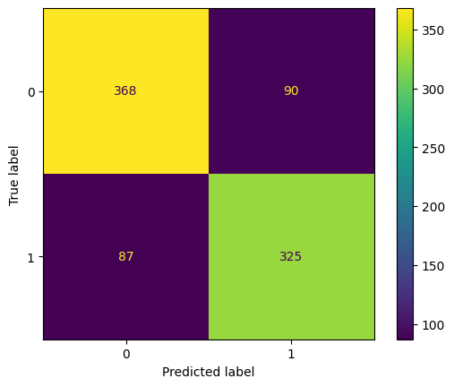

# Spaceship Titanic Prediction

## 🚀 Project Overview
Welcome to the year 2912, where your data science skills are needed to solve a cosmic mystery. We've received a transmission from four lightyears away and things don't look good.

The **Spaceship Titanic** was an interstellar passenger liner launched a month ago. With almost 13,000 passengers on board, the vessel set out on its maiden voyage transporting emigrants from our solar system to three newly habitable planets orbiting nearby stars.

While rounding Alpha Centauri en route to its first destination—the torrid 55 Cancri e—the Spaceship Titanic collided with a spacetime anomaly hidden within a dust cloud. Sadly, it met a similar fate as its namesake from two millennia ago. Though the ship stayed intact, almost half of the passengers were transported to an alternate dimension!

To help rescue crews and retrieve the lost passengers, you are challenged to predict which passengers were transported by the anomaly using records recovered from the spaceship’s damaged computer system.

## 📊 Dataset Description
The dataset consists of personal records for about 8,700 passengers.
- `PassengerId` - A unique Id for each passenger.
- `HomePlanet` - The planet the passenger departed from.
- `CryoSleep` - Indicates whether the passenger elected to be put into suspended animation.
- `Cabin` - The cabin number where the passenger is staying.
- `Destination` - The planet the passenger will be debarking to.
- `Age` - The age of the passenger.
- `VIP` - Whether the passenger has paid for special VIP service.
- `RoomService`, `FoodCourt`, `ShoppingMall`, `Spa`, `VRDeck` - Amount the passenger has billed at each of the Spaceship Titanic's many luxury amenities.
- `Name` - The first and last names of the passenger.
- `Transported` - Whether the passenger was transported to another dimension (Target variable).

## 🛠️ Tools & Technologies
- **Python** (v3.x)
- **Pandas** for data manipulation
- **NumPy** for numerical computations
- **Matplotlib** & **Seaborn** for data visualization
- **Scikit-Learn** for machine learning models
- **XGBoost** for gradient boosting

## 🧠 Machine Learning Workflow
1. **Data Loading**: Importing the dataset from CSV.
2. **Exploratory Data Analysis (EDA)**:
   - Visualizing missing data patterns.
   - Analyzing correlations between passenger attributes and the transportation status.
   - Studying spending patterns of VIP vs non-VIP passengers.
3. **Data Preprocessing**:
   - **Missing Value Imputation**: Strategically filling missing values based on logic (e.g., passengers in CryoSleep spend 0 on amenities) and statistical measures (mean/mode).
   - **Feature Engineering**: Extracting `RoomNo` and `PassengerNo` from the `PassengerId`.
   - **Handling Outliers**: Treating extreme values in attributes like `Age`.
4. **Modeling**:
   - Training and evaluating multiple classifiers:
     - **Support Vector Classifier (SVC)**
     - **Logistic Regression**
     - **XGBClassifier**
5. **Evaluation**: Comparing model performance to identify the best predictor for passenger transportation.

## 📈 Results
The project implements a full pipeline from raw data to predictions, identifying key factors like `CryoSleep` and luxury amenity spending as strong indicators of whether a passenger was transported.



## 📝 How to Run
1. Clone this repository:
   ```bash
   git clone https://github.com/fatahrahimi330/100-Machine-Learning-Projects.git
   ```
2. Navigate to the project directory:
   ```bash
   cd "60-Spaceship Titanic"
   ```
3. Install the required dependencies:
   ```bash
   pip install numpy pandas matplotlib seaborn scikit-learn xgboost
   ```
4. Run the Jupyter Notebook:
   ```bash
   jupyter notebook SpaceshipTitanic.ipynb
   ```

## 🤝 Contributing
Contributions, issues, and feature requests are welcome! Feel free to check the [issues page](https://github.com/fatahrahimi330/100-Machine-Learning-Projects/issues).

---
*Developed as part of the 100+ Machine Learning Projects challenge.*
