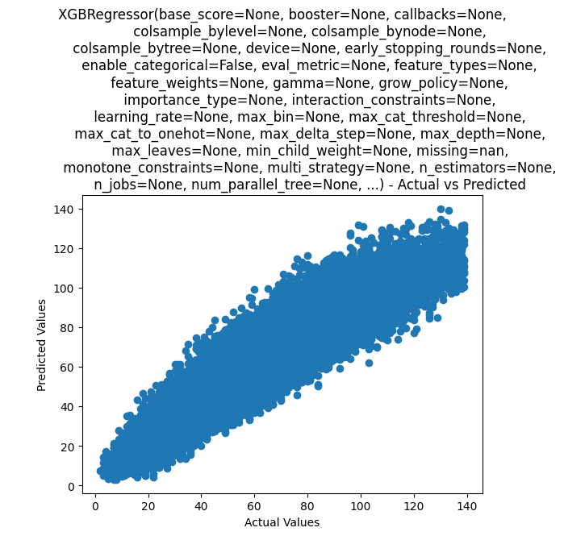
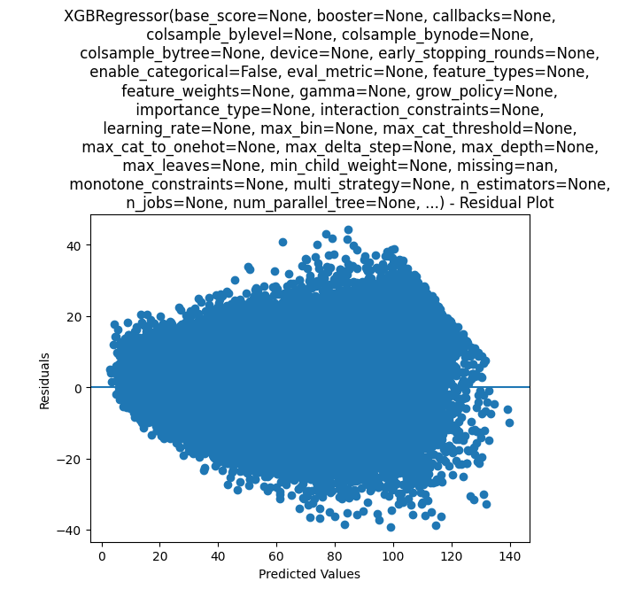
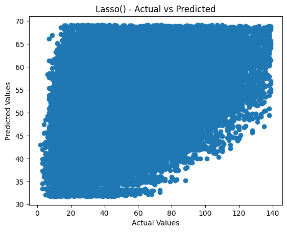
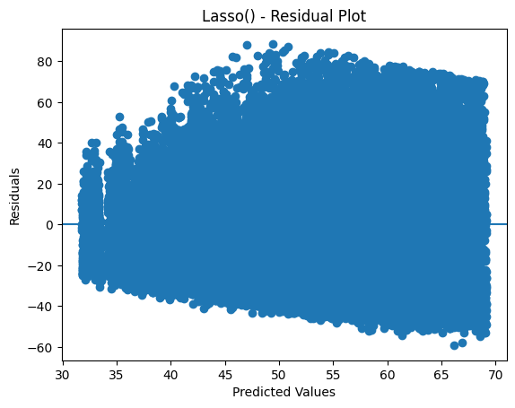
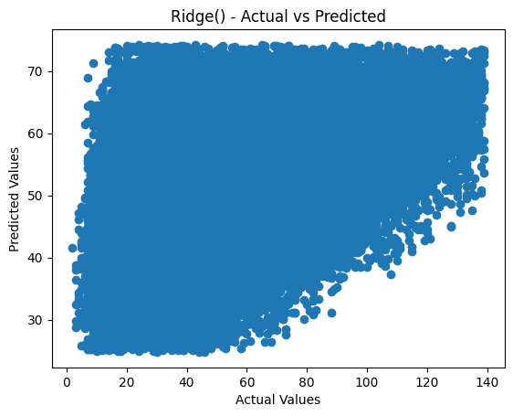
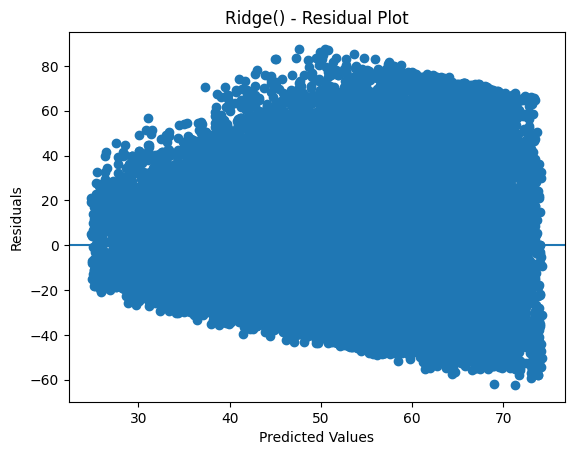

# Inventory Demand Forecasting


This project aims to predict future inventory demand (sales) using historical time-series data. By accurately forecasting demand, businesses can optimize inventory levels, reduce costs associated with overstocking, and prevent stockouts.

## 📊 Project Overview

The project follows a standard machine learning workflow, including data preprocessing, feature engineering, model selection, and performance evaluation. It implements multiple regression algorithms to compare their effectiveness in predicting daily sales.

### Key Features of the Implementation:
- **Temporal Feature Engineering**: Extraction of Year, Month, Day, and Weekdays.
- **External Factors**: Integration of Indian holiday data using the `holidays` library.
- **Cyclical Features**: Cyclic encoding of months using Sine and Cosine transformations to capture seasonality.
- **Predictive Models**: Lasso Regression, Ridge Regression, XGBRegressor, and Random Forest Regressor.

## 📁 Dataset

The dataset used in this project is a historical sales record containing:
- `date`: The timestamp of the sale.
- `store`: ID of the store.
- `item`: ID of the item.
- `sales`: Number of units sold (Target variable).

The project uses a `train.csv` file, which is processed to create features suitable for regression models.

## 🛠️ Installation

To run this project locally, ensure you have Python installed, then install the necessary dependencies:

```bash
pip install numpy pandas matplotlib seaborn scikit-learn xgboost holidays
```

## 🚀 Usage

1. Clone the repository:
   ```bash
   git clone https://github.com/fatahrahimi330/100-Machine-Learning-Projects.git
   ```
2. Navigate to the project directory:
   ```bash
   cd "61-Inventory Demand Forecasting"
   ```
3. Open and run the Jupyter Notebook:
   ```bash
   jupyter notebook InventoryDemandForecasting.ipynb
   ```

## 🤖 Models & Evaluation

The following models were trained and evaluated:
- **Lasso & Ridge Regression**: Linear models with L1 and L2 regularization.
- **Random Forest Regressor**: An ensemble learning method for regression.
- **XGBRegressor**: A powerful gradient boosting algorithm.

### Performance Metrics:
Models are evaluated based on:
- **Mean Absolute Error (MAE)**
- **Mean Squared Error (MSE)**
- **Root Mean Squared Error (RMSE)**
- **R² Score** (Coefficient of Determination)

## 📈 Results

The notebook includes detailed visualizations and comparisons of model performance. Feature importance analysis is also conducted to understand which factors (like weekends or holidays) significantly impact inventory demand.







## 🤝 Contributing

Contributions are welcome! Feel free to open an issue or submit a pull request if you have suggestions for improvement.

## 📜 License

This project is licensed under the MIT License.
