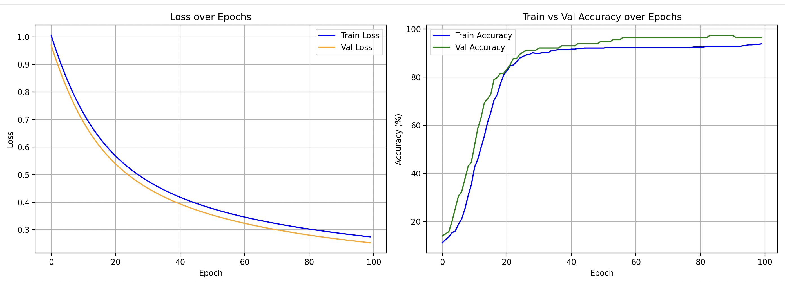

# 🔬 Breast Cancer Prediction with PyTorch

A binary classification project that uses Logistic Regression built from scratch in PyTorch to predict whether a breast tumor is **malignant** or **benign**, trained on the classic Wisconsin Breast Cancer dataset.

---

## 📌 Overview

| Property       | Detail                          |
|----------------|---------------------------------|
| Dataset        | `sklearn` Breast Cancer Dataset |
| Samples        | 569                             |
| Features       | 30                              |
| Task           | Binary Classification           |
| Model          | Logistic Regression (PyTorch)   |
| Loss Function  | Binary Cross-Entropy (`BCELoss`)|
| Optimizer      | SGD (`lr=0.01`)                 |
| Epochs         | 100                             |

---

## 📁 Project Structure

```
67-Breath Cancer Prediction Pytorch/
│
├── breath_cancer_predction.py   # Main training script
└── README.md
```

---

## 🧠 Model Architecture

```python
class LogisticRegression(nn.Module):
    def __init__(self, n_features: int):
        super().__init__()
        self.linear = nn.Linear(n_features, 1)

    def forward(self, x: torch.Tensor) -> torch.Tensor:
        return torch.sigmoid(self.linear(x))
```

A single linear layer followed by a sigmoid activation — perfect for binary classification tasks.

---

## ⚙️ Pipeline

```
Load Data → Train/Test Split (80/20) → StandardScaler
    → Convert to Tensors → Train Model → Evaluate → Plot
```

1. **Load** — Breast Cancer dataset from `sklearn.datasets`
2. **Split** — 80% train, 20% test (`random_state=42`)
3. **Scale** — `StandardScaler` fit on train, applied to test
4. **Convert** — NumPy arrays → `float32` PyTorch tensors
5. **Train** — Forward pass → BCE Loss → Backprop → SGD update
6. **Evaluate** — Loss & accuracy tracked each epoch
7. **Plot** — Loss and accuracy curves visualized with Matplotlib

---

## 📊 Results

Training prints metrics every 10 epochs:

```
Epoch: 10/100 | Train Loss: 0.4210 | Val Loss: 0.3891 | Train Acc: 92.31% | Val Acc: 93.86%
Epoch: 20/100 | Train Loss: 0.3501 | Val Loss: 0.3204 | Train Acc: 93.85% | Val Acc: 94.74%
...
Test Loss: 0.1823 | Test Acc: 95.61%
```

> Results may vary slightly due to random weight initialization.

---

## 📈 Training Curves

Two plots are generated after training:

- **Loss Plot** — Train vs. Validation loss over 100 epochs
- **Accuracy Plot** — Train vs. Validation accuracy over 100 epochs



---

## 🛠️ Requirements

```bash
pip install torch numpy pandas matplotlib seaborn scikit-learn tqdm
```

| Library        | Purpose                        |
|----------------|--------------------------------|
| `torch`        | Model building & training      |
| `scikit-learn` | Dataset & preprocessing        |
| `numpy`        | Array operations               |
| `pandas`       | Data handling                  |
| `matplotlib`   | Plotting loss & accuracy       |
| `seaborn`      | Plot styling                   |
| `tqdm`         | Training progress bar          |

---

## 🚀 Run

```bash
python breath_cancer_predction.py
```

---

## 📚 Dataset

The [Wisconsin Breast Cancer Dataset](https://scikit-learn.org/stable/modules/generated/sklearn.datasets.load_breast_cancer.html) contains 569 samples with 30 numerical features computed from digitized images of fine needle aspirate (FNA) of breast masses. The target is binary: `0 = malignant`, `1 = benign`.

---

## 🧾 License

This project is part of the [100+ Machine Learning Projects](https://github.com/) series for learning purposes.